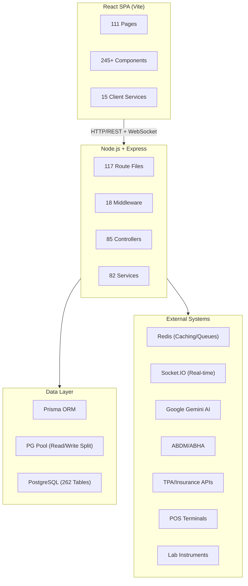
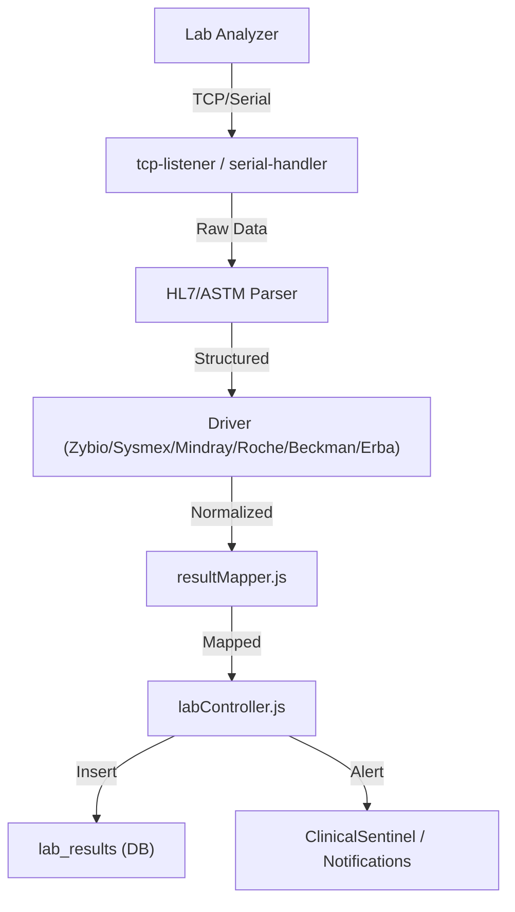
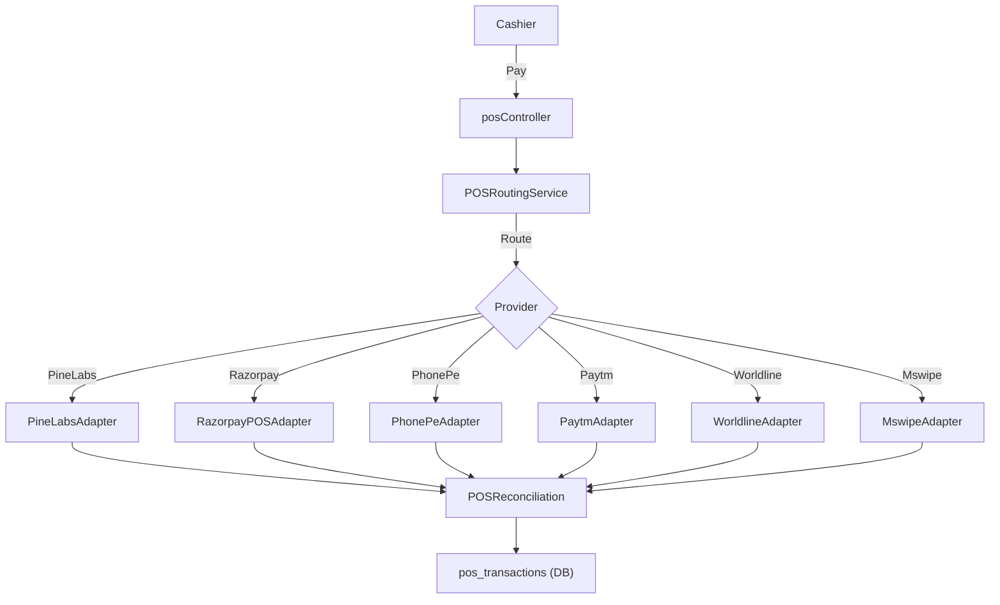
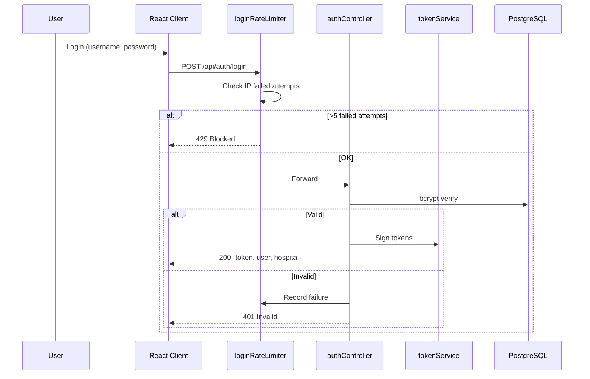
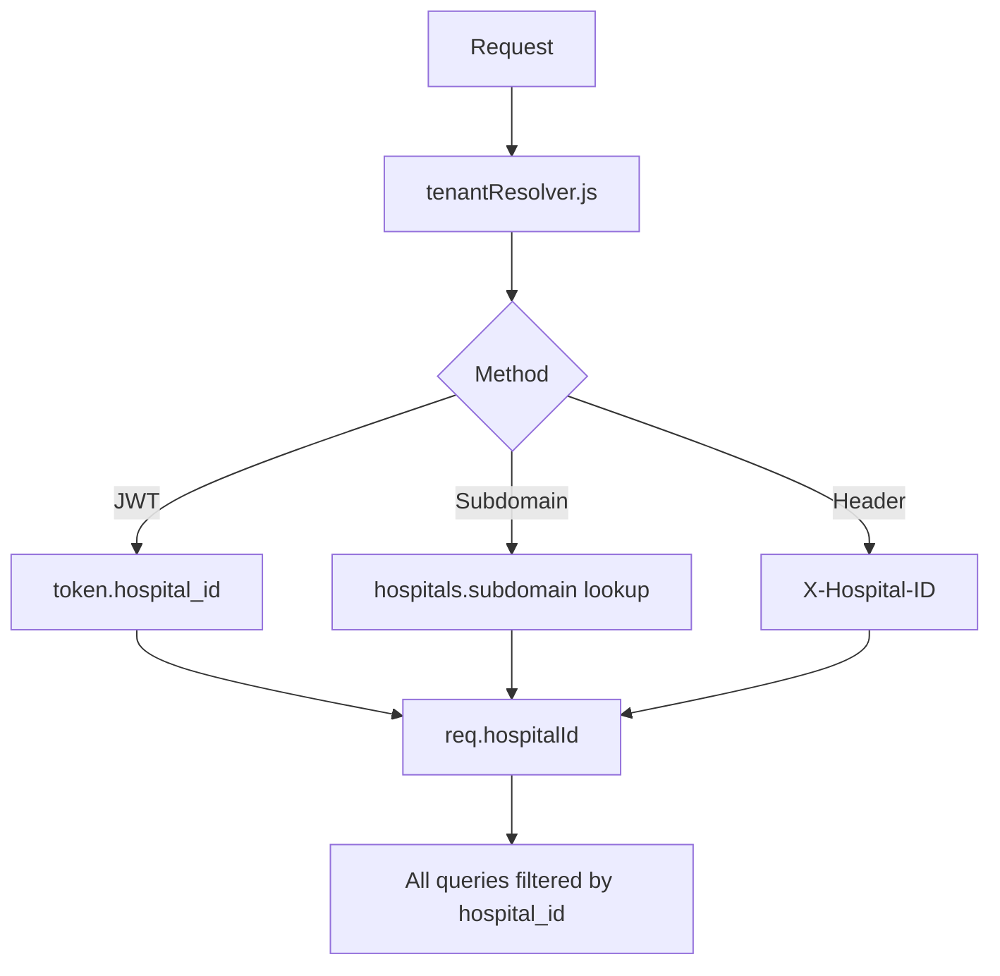
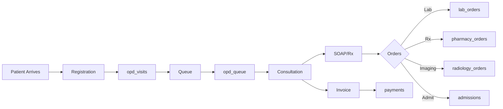
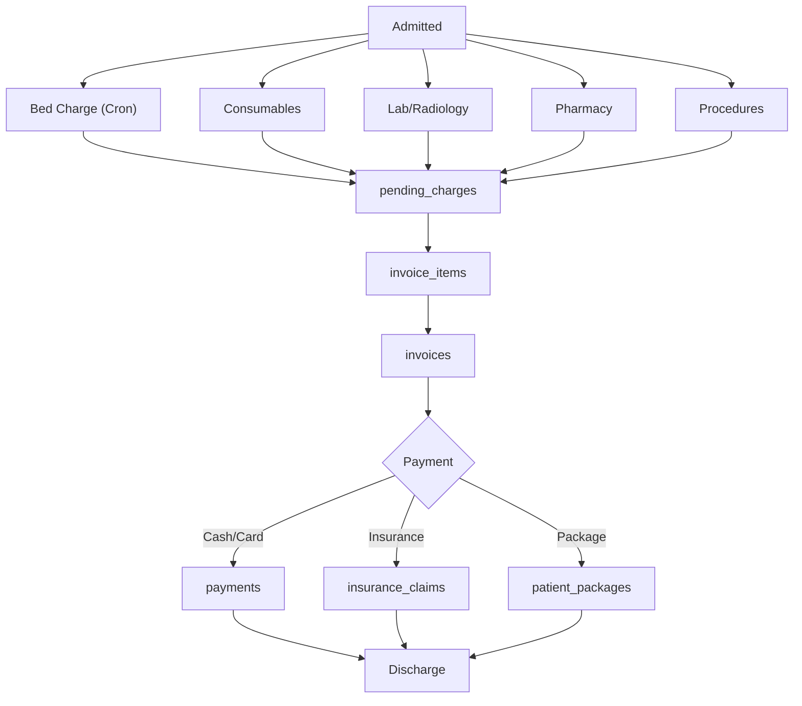
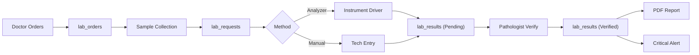

# 🐺 Wolf HMS — Enterprise Hospital Management System Blueprint

> **Version**: 2.0.0 · **Stack**: Node.js + Express + PostgreSQL + Prisma + React (Vite) · **Node**: ≥20.0.0
> **Architecture**: Monolithic Server + SPA Client · **Multi-Tenancy**: Hospital-Scoped (hospital_id FK on all tables)
> **Generated**: 2026-07-16 · **Reverified**: 2026-07-16 (100% file coverage confirmed)

---

## Table of Contents

1. [System Overview](#1-system-overview)
2. [Technology Stack](#2-technology-stack)
3. [Database Schema — 262 Tables](#3-database-schema--262-tables)
4. [Server Architecture](#4-server-architecture)
5. [Controllers — 85 Files](#5-controllers--85-files)
6. [Routes — 117 Files (Complete Mount Map)](#6-routes--117-files-complete-mount-map)
7. [Services — 82 Files (incl. adapters)](#7-services--82-files-incl-adapters)
8. [Middleware — 18 Files](#8-middleware--18-files)
9. [Infrastructure Layer](#9-infrastructure-layer)
10. [Client Architecture — Complete Inventory](#10-client-architecture--complete-inventory)
11. [Server Data, Tests & Tooling](#11-server-data-tests--tooling)
12. [Root-Level Project Structure](#12-root-level-project-structure)
13. [Integration & Interop](#13-integration--interop)
14. [Security Architecture](#14-security-architecture)
15. [Data Flow Diagrams](#15-data-flow-diagrams)

---

## 1. System Overview

Wolf HMS is a full-stack, enterprise-grade Hospital Management System built for multi-hospital (multi-tenant) deployments across India. It covers **every hospital department** from OPD Reception to Mortuary, with specialized modules for Lab Instrument Integration (LIS), Blood Bank, CSSD, Operating Theatre, PMJAY government schemes, and AI-assisted clinical workflows.



---

## 2. Technology Stack

### Backend Dependencies

| Category | Package | Purpose |
|----------|---------|---------|
| **Framework** | `express` ^4.18.2 | HTTP server |
| **ORM** | `@prisma/client` ^5.22.0 | Database ORM (hybrid with raw `pg` pool) |
| **Database** | `pg` ^8.10.0 | PostgreSQL driver |
| **Auth** | `jsonwebtoken` ^9.0.0, `bcryptjs` ^2.4.3 | JWT + password hashing |
| **2FA** | `otplib` ^12.0.1 | TOTP authenticator app |
| **Real-time** | `socket.io` ^4.6.1 | WebSocket events |
| **AI** | `@google/generative-ai` ^0.24.1 | Gemini AI clinical copilot |
| **Security** | `helmet` ^6.0.1, `express-rate-limit` ^6.7.0 | HTTP headers, rate limiting |
| **Caching** | `ioredis` ^5.3.0, `redis` ^4.6.0, `lru-cache` ^11.2.6 | Redis + in-memory cache |
| **Queues** | `bullmq` ^3.10.0 | Background job processing |
| **Monitoring** | `@sentry/node` ^7.53.1, `prom-client` ^14.2.0, `winston` ^3.8.2 | Error tracking, Prometheus metrics, logging |
| **PDF** | `pdfkit` ^0.17.2, `pdf-parse` ^2.4.5 | Prescription/report PDF generation |
| **Payments** | `razorpay` ^2.9.6 | Payment gateway |
| **Video** | `livekit-server-sdk` ^2.15.0 | Telehealth video calls |
| **Comms** | `nodemailer` ^8.0.4, `node-telegram-bot-api` ^0.67.0 | Email, Telegram alerts |
| **Interop** | `node-x12` ^1.7.1 | EDI/X12 insurance claims |
| **Geo** | `@turf/boolean-point-in-polygon` ^7.3.1 | Geofencing (security patrols) |
| **Validation** | `joi` ^18.0.2, `zod` ^4.3.5 | Input validation |
| **API Docs** | `swagger-jsdoc` ^6.2.8, `swagger-ui-express` ^5.0.1 | OpenAPI/Swagger |
| **Barcode** | `qrcode` ^1.5.4 | QR codes for wristbands/cards |
| **File Upload** | `multer` ^1.4.5-lts.1 | Multipart file handling |
| **Scheduling** | `node-cron` ^4.2.1 | Cron-based scheduled tasks |
| **CSV** | `csv-parser` ^3.2.0 | CSV data import |
| **Google** | `googleapis` ^126.0.0 | Google APIs |
| **Date** | `date-fns` ^4.1.0 | Date manipulation |
| **Math** | `cubic-spline` ^3.0.3 | Curve fitting (vitals trends) |
| **UUID** | `uuid` ^9.0.0 | UUID generation |

### Frontend Dependencies

| Category | Package | Purpose |
|----------|---------|---------|
| **Framework** | `react` ^18.3.1, `react-dom` ^18.3.1 | UI framework |
| **Build** | `vite` ^5.4.11 | Development/build tool |
| **Routing** | `react-router-dom` ^6.20.0 | SPA routing |
| **UI Kit** | `react-bootstrap` ^2.10.10, `bootstrap` ^5.3.8 | Component library |
| **Icons** | `lucide-react` ^0.555.0 | Icon set |
| **Charts** | `recharts` ^2.10.3 | Data visualization |
| **Calendar** | `react-big-calendar` ^1.19.4 | Appointment scheduling |
| **Maps** | `leaflet` ^1.9.4, `react-leaflet` ^4.2.1, `@turf/bbox` ^7.3.1 | Geolocation maps |
| **Real-time** | `socket.io-client` ^4.7.2 | WebSocket client |
| **HTTP** | `axios` ^1.6.0 | API calls |
| **QR** | `qrcode.react` ^4.2.0 | QR code rendering |
| **Date** | `date-fns` ^4.1.0 | Date manipulation |

---

## 3. Database Schema — 262 Tables

> **ORM**: Prisma (schema defined in [schema.prisma](file:///c:/Users/HP/.gemini/antigravity/scratch/wolf-hms-stable/server/prisma/schema.prisma))
> **Pool**: Read/Write split via [dbPools.js](file:///c:/Users/HP/.gemini/antigravity/scratch/wolf-hms-stable/server/config/dbPools.js)
> **Multi-Tenancy**: Most tables carry a `hospital_id` FK for tenant isolation

### 3.1 Core Identity & Auth (12 tables)

| Table | Purpose |
|-------|---------|
| `users` | All staff accounts (doctors, nurses, admins, pharmacists, lab techs, guards) |
| `hospitals` | Tenant registry — each hospital is a tenant |
| `hospital_admins` | Hospital-to-admin mapping |
| `hospital_settings` | Per-hospital config key-value store |
| `hospital_profile` | Hospital branding, contact info |
| `hospital_branding` | Logo, color scheme, theme per tenant |
| `hospital_templates` | Print templates (letterhead, invoice format) |
| `hospital_assets` | Physical assets registry |
| `refresh_tokens` | JWT refresh token storage |
| `user_sessions` | Active session tracking |
| `access_logs` | Login/access audit trail |
| `mfa_attempts` | Multi-factor auth attempt log |

### 3.2 Patient Management (10 tables)

| Table | Purpose |
|-------|---------|
| `patients` | Master patient index (UHID generation) |
| `patient_documents` | Uploaded scans, reports, IDs |
| `patient_history` | Change audit log for patient records |
| `patient_insurance` | Insurance policy linkage per patient |
| `patient_links` | ABDM/ABHA cross-hospital linking |
| `patient_consent_logs` | Consent form signatures |
| `patient_vitals` | Recorded vital signs |
| `patient_consumables` | Consumables used per patient |
| `patient_service_charges` | Service charges applied |
| `master_identities` | Enterprise Master Patient Index (EMPI) |

### 3.3 OPD — Outpatient (5 tables)

| Table | Purpose |
|-------|---------|
| `opd_visits` | OPD visit records (registration, triage, consultation) |
| `opd_queue` | Real-time doctor queue management |
| `appointments` | Scheduled appointments |
| `doctor_slots` | Doctor availability slots |
| `doctor_consultations` | Consultation log |

### 3.4 IPD — Inpatient & Admissions (10 tables)

| Table | Purpose |
|-------|---------|
| `admissions` | IPD admission records |
| `beds` | Bed inventory with status |
| `bed_history` | Bed transfer/assignment history |
| `wards` | Ward registry (General, ICU, Pediatric, etc.) |
| `ward_charges` | Per-ward daily charges |
| `ward_consumables` | Ward-level consumable tracking |
| `ward_service_charges` | Ward-specific service rates |
| `ward_requests` | Inter-ward supply requests |
| `ward_change_requests` | Bed/ward transfer requests |
| `discharge_plans` | Discharge planning & checklists |

### 3.5 Clinical & Nursing (22 tables)

| Table | Purpose |
|-------|---------|
| `clinical_vitals` | Structured vitals (BP, HR, SpO2, Temp) |
| `clinical_alerts` | Clinical warning alerts |
| `clinical_history` | Past medical/surgical history |
| `clinical_tasks` | Clinical task orders |
| `vitals` / `vitals_logs` / `vital_logs` | Legacy vitals (3 tables) |
| `soap_notes` | SOAP clinical notes |
| `round_notes` | Ward round documentation |
| `prescriptions` | Medication prescriptions |
| `procedures` | Procedures performed |
| `nurse_assignments` | Nurse-to-patient assignment |
| `nurse_care_tasks` | Nursing care task tracking |
| `nursing_care_plans` | Standardized care plans |
| `care_plan_templates` | Care plan template library |
| `care_tasks` | Individual care task items |
| `patient_care_plans` | Active patient care plans |
| `pain_assessments` / `pain_scores` | Pain scoring (NRS/VAS) |
| `fall_risk_assessments` | Morse fall risk scoring |
| `wound_assessments` | Wound care documentation |
| `shift_handovers` / `shift_handoff_notes` | SBAR/nurse handoff |
| `handoff_reports` | Structured shift handoff |
| `medication_administration` | eMAR: medication admin log |

### 3.6 Laboratory (26 tables)

| Table | Purpose |
|-------|---------|
| `lab_orders` | Lab test orders |
| `lab_requests` | Sample collection requests |
| `lab_request_tests` | Individual tests within a request |
| `lab_results` | Test results |
| `lab_result_versions` | Result version history |
| `lab_test_types` | Test catalog |
| `lab_test_categories` | Category grouping |
| `lab_parameters` | Parameter definitions per test |
| `lab_parameter_categories` | Parameter grouping |
| `lab_parameter_mappings` | Test-to-parameter mapping |
| `lab_reference_ranges` | Age/gender-specific reference ranges |
| `lab_packages` / `lab_package_items` | Test panels/packages |
| `lab_payments` | Lab billing |
| `lab_instruments` | Connected analyzer registry |
| `lab_reagents` | Reagent inventory |
| `lab_qc_materials` / `lab_qc_results` | Quality control |
| `lab_critical_values` / `lab_critical_alerts` | Critical value rules & alerts |
| `lab_audit_log` | Lab operation audit trail |
| `lab_change_requests` | Result amendment requests |
| `lab_public_reports` | Public-facing report sharing |
| `lab_revenue_log` | Lab revenue tracking |
| `lab_tat_log` | Turnaround time tracking |
| `lab_parameters_backup_2026` | Parameter backup snapshot |

### 3.7 Pharmacy (10 tables)

| Table | Purpose |
|-------|---------|
| `inventory_items` | Medicine inventory (stock, expiry, batch) |
| `inventory_transfers` | Inter-pharmacy/ward transfers |
| `pharmacy_orders` / `pharmacy_order_items` | Prescription-based orders |
| `pharmacy_refunds` | Medicine return/refund |
| `pharmacy_price_requests` | Price change requests |
| `dispense_logs` | Dispensation audit log |
| `drug_logs` | Drug usage tracking |
| `controlled_substance_log` | Narcotic/controlled drug register |
| `emar_logs` | Electronic Medication Administration Record |

### 3.8 Blood Bank (15 tables)

| Table | Purpose |
|-------|---------|
| `blood_units` | Blood unit inventory |
| `blood_requests` | Cross-match & issue requests |
| `blood_donors` | Donor registry |
| `blood_transfusions` | Transfusion records |
| `blood_cross_matches` | Cross-match results |
| `blood_component_types` | Blood component catalog |
| `blood_service_charges` | Blood bank service rates |
| `blood_donation_campaigns` | Donation camp management |
| `blood_storage_equipment` | Refrigerator/freezer registry |
| `blood_temperature_log` | Storage temperature monitoring |
| `blood_exempt_conditions` | Exemption rules |
| `transfusion_reactions` | Adverse reaction tracking |
| `surgery_blood_requirements` | Pre-op blood requirements |
| `surgery_blood_prepared` | Cross-matched blood for surgery |
| `surgery_blood_standards` | Blood order schedule per surgery type |

### 3.9 Radiology (3 tables)

`radiology_orders`, `radiology_templates`, `sample_journey`

### 3.10 Operating Theatre & Surgical (12 tables)

`ot_rooms`, `ot_schedules`, `surgeries`, `surgery_checklists`, `pac_assessments`, `anaesthesia_charts`, `pacu_records`, `cssd_trays`, `sterilization_cycles`, `instrument_drivers`, `instrument_logs`, `instrument_test_mapping`

### 3.11 Finance & Billing (26 tables)

`invoices`, `invoice_items`, `invoice_payments`, `invoice_split_ledger`, `payments`, `pending_charges`, `billing_kpis`, `accounting_periods`, `doctor_payouts`, `collections_worklist`, `b2b_invoices`, `b2b_payments`, `service_master`, `payment_settings`, `payment_confirmation_settings`, `adjustments`, `pos_devices`, `pos_transactions`, `pos_credentials`, `pos_providers`, `pos_refunds`, `pos_settlements`, `pos_activity_log`, `erp_ledger_mappings`, `erp_sync_logs`, `consumable_usage`

### 3.12 Insurance & TPA (12 tables)

`insurance_providers`, `insurance_claims`, `insurance_preauth`, `preauth_requests`, `tpa_providers`, `tpa_credentials`, `tpa_activity_log`, `payer_profiles`, `claim_denials`, `denial_codes`, `claim_scrub_rules`, `claim_scrub_results`, `eligibility_checks`

### 3.13 PMJAY / Government Schemes (8 tables)

`pmjay_beneficiaries`, `pmjay_claims`, `pmjay_packages`, `pmjay_specialties`, `pmjay_procedures`, `pmjay_hospital_empanelment`, `pmjay_hospital_mappings`, `pmjay_package_usage`

### 3.14 Treatment Packages (6 tables)

`treatment_packages`, `package_items`, `package_extras`, `patient_packages`, `package_usage_log`, `tenant_package_rates`

### 3.15 Corporate & Specialist (4 tables)

`corporate_contracts`, `specialist_categories`, `doctor_reviews`, `review_helpful`

### 3.16 Emergency & Ambulance (2 tables)

`emergency_logs`, `emergency_status`

### 3.17 Security & Visitor Management (12 tables)

`security_checkpoints`, `security_gates`, `security_geofences`, `security_incidents`, `security_missions`, `security_patrols`, `security_visitors`, `guard_locations`, `guard_shifts`, `visitors`, `parking_sessions`, `parking_violations`

### 3.18 Support Services (4 tables)

`housekeeping_tasks`, `dietary_orders`, `death_records`, `mortuary_chambers`

### 3.19 Equipment & Procurement (8 tables)

`equipment_inventory`, `equipment_types`, `equipment_assignments`, `equipment_billing`, `equipment_change_requests`, `equipment_requests`, `purchase_orders`, `purchase_order_items`, `po_items`, `po_approval_logs`, `suppliers`

### 3.20 Communication & Notifications (6 tables)

`chat_threads`, `chat_messages`, `notification_preferences`, `sms_settings`, `translations`, `domain_verifications`

### 3.21 Platform & SaaS (14 tables)

`tenant_integrations`, `tenant_usage`, `app_build_history`, `hospital_app_builds`, `system_settings`, `system_logs`, `schema_migrations`, `public_migrations`, `migration_errors`, `migration_jobs`, `role_permissions`, `data_anonymization_logs`, `data_retention_policy`, `platform_audit_logs`, `audit_logs`, `admin_audit_log`, `hospital_audit_log`

### 3.22 AI & Analytics (5 tables)

`ai_billing_predictions`, `icd_code_suggestions`, `api_usage_stats`, `sensor_logs`, `approval_matrices`, `instrument_stats`

### 3.23 Webhooks & Integration (5 tables)

`webhooks`, `webhook_deliveries`, `webhook_event_types`, `edi_transmissions`, `archive_logs`

### 3.24 Family & Patient Portal (3 tables)

`family_members`, `article_bookmarks`, `order_sets`

### 3.25 Specialty Modules (5 tables)

`chemo_cycles`, `chemo_sessions`, `oncology_staging`, `dialysis_sessions`, `iv_lines`, `fluid_balance`

### 3.26 Miscellaneous

`reagent_usage_log`, `safety_counts`, `vehicle_inspections`, `floor_plans`, `visits`

---

## 4. Server Architecture

### Entry Point

[server.js](file:///c:/Users/HP/.gemini/antigravity/scratch/wolf-hms-stable/server/server.js) (1,293 lines) — Main entry, mounts all middleware and routes.

### Directory Structure

```
server/
├── server.js                  # Entry point (1,293 lines)
├── server-cloud.js            # Cloud deployment variant
├── server-cloud-fixed.js      # Cloud deployment (hardened)
├── db.js                      # Legacy PG pool export
├── config/                    # 13 files
│   ├── dbPools.js             # Read/Write pool separation
│   ├── db.js                  # DB connection config
│   ├── db-cloud.js            # Cloud SQL config
│   ├── cache.js               # Redis + LRU cache wrapper
│   ├── prisma.js              # Prisma client singleton
│   ├── messageQueue.js        # BullMQ queue factory
│   ├── sentry.js              # Sentry error tracking
│   ├── swagger.js             # Swagger/OpenAPI config
│   ├── hmsConstants.js        # Application constants
│   ├── permissions.js         # RBAC permission definitions
│   ├── platformOwners.js      # Platform admin list
│   ├── backup_settings.json   # Backup configuration
│   └── orthanc/               # DICOM/PACS config
│       ├── orthanc.json       # Orthanc DICOM server config
│       └── wolf-hms-webhook.lua # Orthanc webhook handler
├── controllers/               # 85 files (see §5)
├── routes/                    # 117 files (see §6)
├── services/                  # 82 files incl. adapters (see §7)
├── middleware/                # 18 files (see §8)
├── utils/                     # 10 files
├── lib/                       # Protocol parsers & instrument drivers
├── workers/                   # 2 background workers
├── events/                    # 1 event bus
├── cron/                      # 1 ERP sync cron
├── queue/                     # 1 queue factory
├── validators/                # 1 clinical validator
├── tools/                     # 1 diagnostic tool
├── data/                      # 3 clinical data catalogs
├── docs/                      # 1 scale-up guide
├── tests/                     # 65+ test files
├── prisma/                    # Schema + migrations
├── migrations/                # 167 SQL migration files
├── scripts/                   # 216 utility scripts
└── public/                    # Static assets
```

---

## 5. Controllers — 85 Files

> All in [server/controllers/](file:///c:/Users/HP/.gemini/antigravity/scratch/wolf-hms-stable/server/controllers)

### 5.1 Clinical Domain (21 controllers)

| Controller | File |
|------------|------|
| OPD | [opdController.js](file:///c:/Users/HP/.gemini/antigravity/scratch/wolf-hms-stable/server/controllers/opdController.js) |
| Admission | [admissionController.js](file:///c:/Users/HP/.gemini/antigravity/scratch/wolf-hms-stable/server/controllers/admissionController.js) |
| Discharge | [dischargeController.js](file:///c:/Users/HP/.gemini/antigravity/scratch/wolf-hms-stable/server/controllers/dischargeController.js) |
| Clinical | [clinicalController.js](file:///c:/Users/HP/.gemini/antigravity/scratch/wolf-hms-stable/server/controllers/clinicalController.js) |
| Nurse | [nurseController.js](file:///c:/Users/HP/.gemini/antigravity/scratch/wolf-hms-stable/server/controllers/nurseController.js) |
| Vitals | [vitalsController.js](file:///c:/Users/HP/.gemini/antigravity/scratch/wolf-hms-stable/server/controllers/vitalsController.js) |
| Prescription | [prescriptionController.js](file:///c:/Users/HP/.gemini/antigravity/scratch/wolf-hms-stable/server/controllers/prescriptionController.js) |
| Procedure | [procedureController.js](file:///c:/Users/HP/.gemini/antigravity/scratch/wolf-hms-stable/server/controllers/procedureController.js) |
| Problem List | [problemListController.js](file:///c:/Users/HP/.gemini/antigravity/scratch/wolf-hms-stable/server/controllers/problemListController.js) |
| Care Plan | [carePlanController.js](file:///c:/Users/HP/.gemini/antigravity/scratch/wolf-hms-stable/server/controllers/carePlanController.js) |
| Alert | [alertController.js](file:///c:/Users/HP/.gemini/antigravity/scratch/wolf-hms-stable/server/controllers/alertController.js) |
| Transfer | [transferController.js](file:///c:/Users/HP/.gemini/antigravity/scratch/wolf-hms-stable/server/controllers/transferController.js) |
| Transition | [transitionController.js](file:///c:/Users/HP/.gemini/antigravity/scratch/wolf-hms-stable/server/controllers/transitionController.js) |
| Ward | [wardController.js](file:///c:/Users/HP/.gemini/antigravity/scratch/wolf-hms-stable/server/controllers/wardController.js) |
| Ward Pass | [wardPassController.js](file:///c:/Users/HP/.gemini/antigravity/scratch/wolf-hms-stable/server/controllers/wardPassController.js) |
| Bed | [bedController.js](file:///c:/Users/HP/.gemini/antigravity/scratch/wolf-hms-stable/server/controllers/bedController.js) |
| Appointment | [appointmentController.js](file:///c:/Users/HP/.gemini/antigravity/scratch/wolf-hms-stable/server/controllers/appointmentController.js) |
| Emergency | [emergencyController.js](file:///c:/Users/HP/.gemini/antigravity/scratch/wolf-hms-stable/server/controllers/emergencyController.js) |
| Patient | [patientController.js](file:///c:/Users/HP/.gemini/antigravity/scratch/wolf-hms-stable/server/controllers/patientController.js) |
| Patient Merge | [patientMergeController.js](file:///c:/Users/HP/.gemini/antigravity/scratch/wolf-hms-stable/server/controllers/patientMergeController.js) |
| Consent | [consentController.js](file:///c:/Users/HP/.gemini/antigravity/scratch/wolf-hms-stable/server/controllers/consentController.js) |

### 5.2 Diagnostics (7 controllers)

| Controller | File |
|------------|------|
| Lab | [labController.js](file:///c:/Users/HP/.gemini/antigravity/scratch/wolf-hms-stable/server/controllers/labController.js) |
| Lab OCR | [labOCRController.js](file:///c:/Users/HP/.gemini/antigravity/scratch/wolf-hms-stable/server/controllers/labOCRController.js) |
| Instrument | [instrumentController.js](file:///c:/Users/HP/.gemini/antigravity/scratch/wolf-hms-stable/server/controllers/instrumentController.js) |
| Radiology | [radiologyController.js](file:///c:/Users/HP/.gemini/antigravity/scratch/wolf-hms-stable/server/controllers/radiologyController.js) |
| Radiology Order | [radiologyOrderController.js](file:///c:/Users/HP/.gemini/antigravity/scratch/wolf-hms-stable/server/controllers/radiologyOrderController.js) |
| Barcode | [barcodeController.js](file:///c:/Users/HP/.gemini/antigravity/scratch/wolf-hms-stable/server/controllers/barcodeController.js) |
| Order Set | [orderSetController.js](file:///c:/Users/HP/.gemini/antigravity/scratch/wolf-hms-stable/server/controllers/orderSetController.js) |

### 5.3 Pharmacy & Blood Bank (2 controllers)

| Controller | File |
|------------|------|
| Pharmacy | [pharmacyController.js](file:///c:/Users/HP/.gemini/antigravity/scratch/wolf-hms-stable/server/controllers/pharmacyController.js) |
| Blood Bank | [bloodBankController.js](file:///c:/Users/HP/.gemini/antigravity/scratch/wolf-hms-stable/server/controllers/bloodBankController.js) |

### 5.4 Surgical Suite (6 controllers)

| Controller | File |
|------------|------|
| OT | [otController.js](file:///c:/Users/HP/.gemini/antigravity/scratch/wolf-hms-stable/server/controllers/otController.js) |
| PAC | [pacController.js](file:///c:/Users/HP/.gemini/antigravity/scratch/wolf-hms-stable/server/controllers/pacController.js) |
| Anaesthesia | [anaesthesiaController.js](file:///c:/Users/HP/.gemini/antigravity/scratch/wolf-hms-stable/server/controllers/anaesthesiaController.js) |
| IntraOp | [intraOpController.js](file:///c:/Users/HP/.gemini/antigravity/scratch/wolf-hms-stable/server/controllers/intraOpController.js) |
| PACU | [pacuController.js](file:///c:/Users/HP/.gemini/antigravity/scratch/wolf-hms-stable/server/controllers/pacuController.js) |
| CSSD | [cssdController.js](file:///c:/Users/HP/.gemini/antigravity/scratch/wolf-hms-stable/server/controllers/cssdController.js) |

### 5.5 Finance & Billing (11 controllers)

| Controller | File |
|------------|------|
| Finance | [financeController.js](file:///c:/Users/HP/.gemini/antigravity/scratch/wolf-hms-stable/server/controllers/financeController.js) (56KB) |
| Charges | [chargesController.js](file:///c:/Users/HP/.gemini/antigravity/scratch/wolf-hms-stable/server/controllers/chargesController.js) |
| Payment | [paymentController.js](file:///c:/Users/HP/.gemini/antigravity/scratch/wolf-hms-stable/server/controllers/paymentController.js) |
| POS | [posController.js](file:///c:/Users/HP/.gemini/antigravity/scratch/wolf-hms-stable/server/controllers/posController.js) |
| Insurance | [insuranceController.js](file:///c:/Users/HP/.gemini/antigravity/scratch/wolf-hms-stable/server/controllers/insuranceController.js) |
| Preauth | [preauthController.js](file:///c:/Users/HP/.gemini/antigravity/scratch/wolf-hms-stable/server/controllers/preauthController.js) |
| TPA | [tpaController.js](file:///c:/Users/HP/.gemini/antigravity/scratch/wolf-hms-stable/server/controllers/tpaController.js) |
| Corporate | [corporateController.js](file:///c:/Users/HP/.gemini/antigravity/scratch/wolf-hms-stable/server/controllers/corporateController.js) |
| Specialist | [specialistController.js](file:///c:/Users/HP/.gemini/antigravity/scratch/wolf-hms-stable/server/controllers/specialistController.js) |
| Treatment Pkg | [treatmentPackageController.js](file:///c:/Users/HP/.gemini/antigravity/scratch/wolf-hms-stable/server/controllers/treatmentPackageController.js) |
| Govt Scheme | [govtSchemeController.js](file:///c:/Users/HP/.gemini/antigravity/scratch/wolf-hms-stable/server/controllers/govtSchemeController.js) |

### 5.6 Auth & Admin (6 controllers)

| Controller | File |
|------------|------|
| Auth | [authController.js](file:///c:/Users/HP/.gemini/antigravity/scratch/wolf-hms-stable/server/controllers/authController.js) |
| Admin | [adminController.js](file:///c:/Users/HP/.gemini/antigravity/scratch/wolf-hms-stable/server/controllers/adminController.js) |
| Admin Recovery | [adminRecoveryController.js](file:///c:/Users/HP/.gemini/antigravity/scratch/wolf-hms-stable/server/controllers/adminRecoveryController.js) |
| MFA | [mfaController.js](file:///c:/Users/HP/.gemini/antigravity/scratch/wolf-hms-stable/server/controllers/mfaController.js) |
| TOTP | [totpController.js](file:///c:/Users/HP/.gemini/antigravity/scratch/wolf-hms-stable/server/controllers/totpController.js) |
| Settings | [settingsController.js](file:///c:/Users/HP/.gemini/antigravity/scratch/wolf-hms-stable/server/controllers/settingsController.js) |

### 5.7 Platform & Multi-Tenancy (7 controllers)

| Controller | File |
|------------|------|
| Hospital | [hospitalController.js](file:///c:/Users/HP/.gemini/antigravity/scratch/wolf-hms-stable/server/controllers/hospitalController.js) |
| Platform | [platformController.js](file:///c:/Users/HP/.gemini/antigravity/scratch/wolf-hms-stable/server/controllers/platformController.js) |
| Setup | [setupController.js](file:///c:/Users/HP/.gemini/antigravity/scratch/wolf-hms-stable/server/controllers/setupController.js) |
| Schema Sync | [schemaSyncController.js](file:///c:/Users/HP/.gemini/antigravity/scratch/wolf-hms-stable/server/controllers/schemaSyncController.js) |
| License | [licenseController.js](file:///c:/Users/HP/.gemini/antigravity/scratch/wolf-hms-stable/server/controllers/licenseController.js) |
| App Build | [appBuildController.js](file:///c:/Users/HP/.gemini/antigravity/scratch/wolf-hms-stable/server/controllers/appBuildController.js) |
| Scale | [scaleController.js](file:///c:/Users/HP/.gemini/antigravity/scratch/wolf-hms-stable/server/controllers/scaleController.js) |

### 5.8 AI & Automation (4 controllers)

| Controller | File |
|------------|------|
| AI | [aiController.js](file:///c:/Users/HP/.gemini/antigravity/scratch/wolf-hms-stable/server/controllers/aiController.js) |
| AI Billing | [aiBillingController.js](file:///c:/Users/HP/.gemini/antigravity/scratch/wolf-hms-stable/server/controllers/aiBillingController.js) |
| Enterprise AI | [enterpriseAIController.js](file:///c:/Users/HP/.gemini/antigravity/scratch/wolf-hms-stable/server/controllers/enterpriseAIController.js) |
| Automation | [automationController.js](file:///c:/Users/HP/.gemini/antigravity/scratch/wolf-hms-stable/server/controllers/automationController.js) |

### 5.9 Analytics (2 controllers)

| Controller | File |
|------------|------|
| Analytics | [analyticsController.js](file:///c:/Users/HP/.gemini/antigravity/scratch/wolf-hms-stable/server/controllers/analyticsController.js) |
| Doctor Analytics | [doctorAnalyticsController.js](file:///c:/Users/HP/.gemini/antigravity/scratch/wolf-hms-stable/server/controllers/doctorAnalyticsController.js) |

### 5.10 Support & Operations (13 controllers)

| Controller | File |
|------------|------|
| Equipment | [equipmentController.js](file:///c:/Users/HP/.gemini/antigravity/scratch/wolf-hms-stable/server/controllers/equipmentController.js) |
| Housekeeping | [housekeepingController.js](file:///c:/Users/HP/.gemini/antigravity/scratch/wolf-hms-stable/server/controllers/housekeepingController.js) |
| Dietary | [dietaryController.js](file:///c:/Users/HP/.gemini/antigravity/scratch/wolf-hms-stable/server/controllers/dietaryController.js) |
| Mortuary | [mortuaryController.js](file:///c:/Users/HP/.gemini/antigravity/scratch/wolf-hms-stable/server/controllers/mortuaryController.js) |
| Medical Records | [medicalRecordsController.js](file:///c:/Users/HP/.gemini/antigravity/scratch/wolf-hms-stable/server/controllers/medicalRecordsController.js) |
| Physio | [physioController.js](file:///c:/Users/HP/.gemini/antigravity/scratch/wolf-hms-stable/server/controllers/physioController.js) |
| Ambulance | [ambulanceController.js](file:///c:/Users/HP/.gemini/antigravity/scratch/wolf-hms-stable/server/controllers/ambulanceController.js) |
| Logistics | [logisticsController.js](file:///c:/Users/HP/.gemini/antigravity/scratch/wolf-hms-stable/server/controllers/logisticsController.js) |
| Parking | [parkingController.js](file:///c:/Users/HP/.gemini/antigravity/scratch/wolf-hms-stable/server/controllers/parkingController.js) |
| Visitor | [visitorController.js](file:///c:/Users/HP/.gemini/antigravity/scratch/wolf-hms-stable/server/controllers/visitorController.js) |
| Reception | [receptionController.js](file:///c:/Users/HP/.gemini/antigravity/scratch/wolf-hms-stable/server/controllers/receptionController.js) |
| Roster | [rosterController.js](file:///c:/Users/HP/.gemini/antigravity/scratch/wolf-hms-stable/server/controllers/rosterController.js) |
| Chat | [chatController.js](file:///c:/Users/HP/.gemini/antigravity/scratch/wolf-hms-stable/server/controllers/chatController.js) |

### 5.11 Security, Interop & Device (6 controllers)

| Controller | File |
|------------|------|
| Security | [securityController.js](file:///c:/Users/HP/.gemini/antigravity/scratch/wolf-hms-stable/server/controllers/securityController.js) |
| Security Handover | [security/handoverController.js](file:///c:/Users/HP/.gemini/antigravity/scratch/wolf-hms-stable/server/controllers/security/handoverController.js) |
| ABDM | [abdmController.js](file:///c:/Users/HP/.gemini/antigravity/scratch/wolf-hms-stable/server/controllers/abdmController.js) |
| HCX Webhook | [HcxWebhookController.js](file:///c:/Users/HP/.gemini/antigravity/scratch/wolf-hms-stable/server/controllers/HcxWebhookController.js) |
| Device | [deviceController.js](file:///c:/Users/HP/.gemini/antigravity/scratch/wolf-hms-stable/server/controllers/deviceController.js) |
| Sync | [syncController.js](file:///c:/Users/HP/.gemini/antigravity/scratch/wolf-hms-stable/server/controllers/syncController.js) |

---

## 6. Routes — 117 Files (Complete Mount Map)

> All in [server/routes/](file:///c:/Users/HP/.gemini/antigravity/scratch/wolf-hms-stable/server/routes)

| API Prefix | Route File | Domain |
|------------|-----------|--------|
| `/api/auth` | [authRoutes.js](file:///c:/Users/HP/.gemini/antigravity/scratch/wolf-hms-stable/server/routes/authRoutes.js) | Authentication |
| `/api/patient-auth` | [patientAuthRoutes.js](file:///c:/Users/HP/.gemini/antigravity/scratch/wolf-hms-stable/server/routes/patientAuthRoutes.js) | Patient OTP auth |
| `/api/2fa` | [totpRoutes.js](file:///c:/Users/HP/.gemini/antigravity/scratch/wolf-hms-stable/server/routes/totpRoutes.js) | Authenticator 2FA |
| `/api/mfa` | [mfaRoutes.js](file:///c:/Users/HP/.gemini/antigravity/scratch/wolf-hms-stable/server/routes/mfaRoutes.js) | MFA management |
| `/api/sessions` | [sessionRoutes.js](file:///c:/Users/HP/.gemini/antigravity/scratch/wolf-hms-stable/server/routes/sessionRoutes.js) | Session management |
| `/api/users` | [userRoutes.js](file:///c:/Users/HP/.gemini/antigravity/scratch/wolf-hms-stable/server/routes/userRoutes.js) | User management |
| `/api/opd` | [opdRoutes.js](file:///c:/Users/HP/.gemini/antigravity/scratch/wolf-hms-stable/server/routes/opdRoutes.js) | OPD workflow |
| `/api/admissions` | [admissionRoutes.js](file:///c:/Users/HP/.gemini/antigravity/scratch/wolf-hms-stable/server/routes/admissionRoutes.js) | IPD admissions |
| `/api/patients` | [patientRoutes.js](file:///c:/Users/HP/.gemini/antigravity/scratch/wolf-hms-stable/server/routes/patientRoutes.js) (79KB) | Patient CRUD |
| `/api/patient-merge` | [patientMergeRoutes.js](file:///c:/Users/HP/.gemini/antigravity/scratch/wolf-hms-stable/server/routes/patientMergeRoutes.js) | Duplicate detection |
| `/api/addresses` | [patientAddressRoutes.js](file:///c:/Users/HP/.gemini/antigravity/scratch/wolf-hms-stable/server/routes/patientAddressRoutes.js) | Delivery addresses |
| `/api/appointments` | [appointmentRoutes.js](file:///c:/Users/HP/.gemini/antigravity/scratch/wolf-hms-stable/server/routes/appointmentRoutes.js) | Scheduling |
| `/api/clinical` | [clinicalRoutes.js](file:///c:/Users/HP/.gemini/antigravity/scratch/wolf-hms-stable/server/routes/clinicalRoutes.js) | Clinical ops |
| `/api/alerts` | [alertRoutes.js](file:///c:/Users/HP/.gemini/antigravity/scratch/wolf-hms-stable/server/routes/alertRoutes.js) | Clinical alerts |
| `/api/consent` | [consentRoutes.js](file:///c:/Users/HP/.gemini/antigravity/scratch/wolf-hms-stable/server/routes/consentRoutes.js) | Consent forms |
| `/api/lab` | [labRoutes.js](file:///c:/Users/HP/.gemini/antigravity/scratch/wolf-hms-stable/server/routes/labRoutes.js) | Laboratory |
| `/api/lab-params` | [labTestParamsRoutes.js](file:///c:/Users/HP/.gemini/antigravity/scratch/wolf-hms-stable/server/routes/labTestParamsRoutes.js) | Lab parameters |
| `/api/pharmacy` | [pharmacyRoutes.js](file:///c:/Users/HP/.gemini/antigravity/scratch/wolf-hms-stable/server/routes/pharmacyRoutes.js) | Pharmacy |
| `/api/inventory` | [inventoryRoutes.js](file:///c:/Users/HP/.gemini/antigravity/scratch/wolf-hms-stable/server/routes/inventoryRoutes.js) | Inventory CRUD |
| `/api/radiology` | [radiologyRoutes.js](file:///c:/Users/HP/.gemini/antigravity/scratch/wolf-hms-stable/server/routes/radiologyRoutes.js) | Radiology |
| `/api/ris` | [radiologyOrderRoutes.js](file:///c:/Users/HP/.gemini/antigravity/scratch/wolf-hms-stable/server/routes/radiologyOrderRoutes.js) | RIS orders |
| `/api/dicom` | [dicomMockRoutes.js](file:///c:/Users/HP/.gemini/antigravity/scratch/wolf-hms-stable/server/routes/dicomMockRoutes.js) | DICOM mock |
| `/api/pacs` | [pacsWebhookRoutes.js](file:///c:/Users/HP/.gemini/antigravity/scratch/wolf-hms-stable/server/routes/pacsWebhookRoutes.js) | PACS webhook |
| `/api/wards` | [wardRoutes.js](file:///c:/Users/HP/.gemini/antigravity/scratch/wolf-hms-stable/server/routes/wardRoutes.js) | Wards |
| `/api/ward-access` | [wardPassRoutes.js](file:///c:/Users/HP/.gemini/antigravity/scratch/wolf-hms-stable/server/routes/wardPassRoutes.js) | Ward passes |
| `/api/beds` | [bedRoutes.js](file:///c:/Users/HP/.gemini/antigravity/scratch/wolf-hms-stable/server/routes/bedRoutes.js) | Beds |
| `/api/nurse` | [nurseRoutes.js](file:///c:/Users/HP/.gemini/antigravity/scratch/wolf-hms-stable/server/routes/nurseRoutes.js) | Nursing |
| `/api/care-plans` | [carePlanRoutes.js](file:///c:/Users/HP/.gemini/antigravity/scratch/wolf-hms-stable/server/routes/carePlanRoutes.js) | Care plans |
| `/api/transitions` | [transitionRoutes.js](file:///c:/Users/HP/.gemini/antigravity/scratch/wolf-hms-stable/server/routes/transitionRoutes.js) | Care transitions |
| `/api/transfer` | [transferRoutes.js](file:///c:/Users/HP/.gemini/antigravity/scratch/wolf-hms-stable/server/routes/transferRoutes.js) | Bed/ward transfer |
| `/api/order-sets` | [orderSetRoutes.js](file:///c:/Users/HP/.gemini/antigravity/scratch/wolf-hms-stable/server/routes/orderSetRoutes.js) | Order sets |
| `/api/problem-list` | [problemListRoutes.js](file:///c:/Users/HP/.gemini/antigravity/scratch/wolf-hms-stable/server/routes/problemListRoutes.js) | Problem list |
| `/api/procedures` | [procedureRoutes.js](file:///c:/Users/HP/.gemini/antigravity/scratch/wolf-hms-stable/server/routes/procedureRoutes.js) | Procedures |
| `/api/emergency` | [emergencyRoutes.js](file:///c:/Users/HP/.gemini/antigravity/scratch/wolf-hms-stable/server/routes/emergencyRoutes.js) | ER |
| `/api/ot` | [otRoutes.js](file:///c:/Users/HP/.gemini/antigravity/scratch/wolf-hms-stable/server/routes/otRoutes.js) | Operating Theatre |
| `/api/pac` | [pacRoutes.js](file:///c:/Users/HP/.gemini/antigravity/scratch/wolf-hms-stable/server/routes/pacRoutes.js) | Pre-anesthetic |
| `/api/pacu` | [pacuRoutes.js](file:///c:/Users/HP/.gemini/antigravity/scratch/wolf-hms-stable/server/routes/pacuRoutes.js) | PACU recovery |
| `/api/anaesthesia` | [anaesthesiaRoutes.js](file:///c:/Users/HP/.gemini/antigravity/scratch/wolf-hms-stable/server/routes/anaesthesiaRoutes.js) | Anaesthesia |
| `/api/intraop` | [intraOpRoutes.js](file:///c:/Users/HP/.gemini/antigravity/scratch/wolf-hms-stable/server/routes/intraOpRoutes.js) | Intra-operative |
| `/api/cssd` | [cssdRoutes.js](file:///c:/Users/HP/.gemini/antigravity/scratch/wolf-hms-stable/server/routes/cssdRoutes.js) | CSSD |
| `/api/finance` | [financeRoutes.js](file:///c:/Users/HP/.gemini/antigravity/scratch/wolf-hms-stable/server/routes/financeRoutes.js) | Finance |
| `/api/finance/insurance` | [insuranceFinanceRoutes.js](file:///c:/Users/HP/.gemini/antigravity/scratch/wolf-hms-stable/server/routes/insuranceFinanceRoutes.js) | Insurance finance |
| `/api/billing` | [billingRoutes.js](file:///c:/Users/HP/.gemini/antigravity/scratch/wolf-hms-stable/server/routes/billingRoutes.js) | Billing |
| `/api/charges` | [chargesRoutes.js](file:///c:/Users/HP/.gemini/antigravity/scratch/wolf-hms-stable/server/routes/chargesRoutes.js) | Charge queue |
| `/api/payments` | [paymentRoutes.js](file:///c:/Users/HP/.gemini/antigravity/scratch/wolf-hms-stable/server/routes/paymentRoutes.js) | Payment gateway |
| `/api/pos` | [posRoutes.js](file:///c:/Users/HP/.gemini/antigravity/scratch/wolf-hms-stable/server/routes/posRoutes.js) | POS terminals |
| `/api/tpa` | [tpaRoutes.js](file:///c:/Users/HP/.gemini/antigravity/scratch/wolf-hms-stable/server/routes/tpaRoutes.js) | TPA integration |
| `/api/insurance` | [insuranceRoutes.js](file:///c:/Users/HP/.gemini/antigravity/scratch/wolf-hms-stable/server/routes/insuranceRoutes.js) | Insurance |
| `/api/preauth` | [preauthRoutes.js](file:///c:/Users/HP/.gemini/antigravity/scratch/wolf-hms-stable/server/routes/preauthRoutes.js) | Pre-auth |
| `/api/packages` | [treatmentPackageRoutes.js](file:///c:/Users/HP/.gemini/antigravity/scratch/wolf-hms-stable/server/routes/treatmentPackageRoutes.js) | Treatment packages |
| `/api/corporate` | [corporateRoutes.js](file:///c:/Users/HP/.gemini/antigravity/scratch/wolf-hms-stable/server/routes/corporateRoutes.js) | Corporate billing |
| `/api/specialists` | [specialistRoutes.js](file:///c:/Users/HP/.gemini/antigravity/scratch/wolf-hms-stable/server/routes/specialistRoutes.js) | Specialist billing |
| `/api/pmjay/hbp` | [pmjayRateRoutes.js](file:///c:/Users/HP/.gemini/antigravity/scratch/wolf-hms-stable/server/routes/pmjayRateRoutes.js) | PMJAY rates |
| `/api/pmjay/claims` | [pmjayClaimRoutes.js](file:///c:/Users/HP/.gemini/antigravity/scratch/wolf-hms-stable/server/routes/pmjayClaimRoutes.js) | PMJAY claims |
| `/api/govt-schemes` | [govtSchemeRoutes.js](file:///c:/Users/HP/.gemini/antigravity/scratch/wolf-hms-stable/server/routes/govtSchemeRoutes.js) | Govt schemes |
| `/api/ai` | [aiRoutes.js](file:///c:/Users/HP/.gemini/antigravity/scratch/wolf-hms-stable/server/routes/aiRoutes.js) | AI copilot |
| `/api/ai` | [enterpriseAIRoutes.js](file:///c:/Users/HP/.gemini/antigravity/scratch/wolf-hms-stable/server/routes/enterpriseAIRoutes.js) | Enterprise AI |
| `/api/ai-billing` | [aiBillingRoutes.js](file:///c:/Users/HP/.gemini/antigravity/scratch/wolf-hms-stable/server/routes/aiBillingRoutes.js) | AI billing |
| `/api/automation` | [automationRoutes.js](file:///c:/Users/HP/.gemini/antigravity/scratch/wolf-hms-stable/server/routes/automationRoutes.js) | Workflow automation |
| `/api/analytics` | [analyticsRoutes.js](file:///c:/Users/HP/.gemini/antigravity/scratch/wolf-hms-stable/server/routes/analyticsRoutes.js) | Analytics |
| `/api/doctor` | [doctorAnalyticsRoutes.js](file:///c:/Users/HP/.gemini/antigravity/scratch/wolf-hms-stable/server/routes/doctorAnalyticsRoutes.js) | Doctor analytics |
| `/api/admin` | [adminRoutes.js](file:///c:/Users/HP/.gemini/antigravity/scratch/wolf-hms-stable/server/routes/adminRoutes.js) | Admin panel |
| `/api/admin` | [adminMigrationRoutes.js](file:///c:/Users/HP/.gemini/antigravity/scratch/wolf-hms-stable/server/routes/adminMigrationRoutes.js) | Admin migrations |
| `/api/admin` | [adminDataStewardRoutes.js](file:///c:/Users/HP/.gemini/antigravity/scratch/wolf-hms-stable/server/routes/adminDataStewardRoutes.js) | AI data steward |
| `/api/admin/recovery` | [adminRecoveryRoutes.js](file:///c:/Users/HP/.gemini/antigravity/scratch/wolf-hms-stable/server/routes/adminRecoveryRoutes.js) | Data recovery |
| `/api/admin/vault` | [vaultRoutes.js](file:///c:/Users/HP/.gemini/antigravity/scratch/wolf-hms-stable/server/routes/vaultRoutes.js) | Credential vault |
| `/api/dashboard` | [dashboardRoutes.js](file:///c:/Users/HP/.gemini/antigravity/scratch/wolf-hms-stable/server/routes/dashboardRoutes.js) | Dashboard KPIs |
| `/api/platform` | [platformRoutes.js](file:///c:/Users/HP/.gemini/antigravity/scratch/wolf-hms-stable/server/routes/platformRoutes.js) | Platform admin |
| `/api/hospitals` | [hospitalRoutes.js](file:///c:/Users/HP/.gemini/antigravity/scratch/wolf-hms-stable/server/routes/hospitalRoutes.js) | Hospital mgmt |
| `/api/branding` | [brandingRoutes.js](file:///c:/Users/HP/.gemini/antigravity/scratch/wolf-hms-stable/server/routes/brandingRoutes.js) | White-label branding |
| `/api/settings` | [settingsRoutes.js](file:///c:/Users/HP/.gemini/antigravity/scratch/wolf-hms-stable/server/routes/settingsRoutes.js) | System settings |
| `/api/license` | [licenseRoutes.js](file:///c:/Users/HP/.gemini/antigravity/scratch/wolf-hms-stable/server/routes/licenseRoutes.js) | License key |
| `/api/scale` | [scaleRoutes.js](file:///c:/Users/HP/.gemini/antigravity/scratch/wolf-hms-stable/server/routes/scaleRoutes.js) | Scaling |
| `/api/builds` | [appBuildRoutes.js](file:///c:/Users/HP/.gemini/antigravity/scratch/wolf-hms-stable/server/routes/appBuildRoutes.js) | App builds |
| `/api/health` | [healthRoutes.js](file:///c:/Users/HP/.gemini/antigravity/scratch/wolf-hms-stable/server/routes/healthRoutes.js) | Health check |
| `/api/metrics` | [metricsRoutes.js](file:///c:/Users/HP/.gemini/antigravity/scratch/wolf-hms-stable/server/routes/metricsRoutes.js) | Prometheus |
| `/api/support` | [supportRoutes.js](file:///c:/Users/HP/.gemini/antigravity/scratch/wolf-hms-stable/server/routes/supportRoutes.js) | Remote support |
| `/api/selfheal` | [selfhealRoutes.js](file:///c:/Users/HP/.gemini/antigravity/scratch/wolf-hms-stable/server/routes/selfhealRoutes.js) | Self-healing |
| `/api/overwatch` | [overwatchRoutes.js](file:///c:/Users/HP/.gemini/antigravity/scratch/wolf-hms-stable/server/routes/overwatchRoutes.js) | AI overwatch |
| `/api/cloud-backup` | [cloudBackupRoutes.js](file:///c:/Users/HP/.gemini/antigravity/scratch/wolf-hms-stable/server/routes/cloudBackupRoutes.js) | Cloud backup |
| `/api/telehealth` | [telehealthRoutes.js](file:///c:/Users/HP/.gemini/antigravity/scratch/wolf-hms-stable/server/routes/telehealthRoutes.js) | Video consults |
| `/api/video` | [videoNotifyRoutes.js](file:///c:/Users/HP/.gemini/antigravity/scratch/wolf-hms-stable/server/routes/videoNotifyRoutes.js) | Video notifications |
| `/api/abdm` | [abdmRoutes.js](file:///c:/Users/HP/.gemini/antigravity/scratch/wolf-hms-stable/server/routes/abdmRoutes.js) | ABDM/ABHA |
| `/api/fhir` | [fhirRoutes.js](file:///c:/Users/HP/.gemini/antigravity/scratch/wolf-hms-stable/server/routes/fhirRoutes.js) | FHIR R4 |
| `/api/webhooks` | [webhookRoutes.js](file:///c:/Users/HP/.gemini/antigravity/scratch/wolf-hms-stable/server/routes/webhookRoutes.js) | Webhooks |
| `/api/barcode` | [barcodeRoutes.js](file:///c:/Users/HP/.gemini/antigravity/scratch/wolf-hms-stable/server/routes/barcodeRoutes.js) | Barcodes |
| `/api/blood-bank` | [bloodBankRoutes.js](file:///c:/Users/HP/.gemini/antigravity/scratch/wolf-hms-stable/server/routes/bloodBankRoutes.js) | Blood bank |
| `/api/equipment` | [equipmentRoutes.js](file:///c:/Users/HP/.gemini/antigravity/scratch/wolf-hms-stable/server/routes/equipmentRoutes.js) | Equipment |
| `/api/instruments` | [instrumentRoutes.js](file:///c:/Users/HP/.gemini/antigravity/scratch/wolf-hms-stable/server/routes/instrumentRoutes.js) | Lab instruments |
| `/api/ipd` | [ipdPatientRoutes.js](file:///c:/Users/HP/.gemini/antigravity/scratch/wolf-hms-stable/server/routes/ipdPatientRoutes.js) | IPD patient portal |
| `/api/medicine-orders` | [medicineOrderRoutes.js](file:///c:/Users/HP/.gemini/antigravity/scratch/wolf-hms-stable/server/routes/medicineOrderRoutes.js) | Medicine ordering |
| `/api/unified-cart` | [unifiedCartRoutes.js](file:///c:/Users/HP/.gemini/antigravity/scratch/wolf-hms-stable/server/routes/unifiedCartRoutes.js) | Unified cart |
| `/api/home-collection` | [homeCollectionRoutes.js](file:///c:/Users/HP/.gemini/antigravity/scratch/wolf-hms-stable/server/routes/homeCollectionRoutes.js) | Home collection |
| `/api/home-lab` | [homeLabRoutes.js](file:///c:/Users/HP/.gemini/antigravity/scratch/wolf-hms-stable/server/routes/homeLabRoutes.js) | Home lab |
| `/api/locations` | [locationRoutes.js](file:///c:/Users/HP/.gemini/antigravity/scratch/wolf-hms-stable/server/routes/locationRoutes.js) | Staff locations |
| `/api/sms` | [smsRoutes.js](file:///c:/Users/HP/.gemini/antigravity/scratch/wolf-hms-stable/server/routes/smsRoutes.js) | SMS service |
| `/api/chat` | [chatRoutes.js](file:///c:/Users/HP/.gemini/antigravity/scratch/wolf-hms-stable/server/routes/chatRoutes.js) | Internal chat |
| `/api/family` | [familyRoutes.js](file:///c:/Users/HP/.gemini/antigravity/scratch/wolf-hms-stable/server/routes/familyRoutes.js) | Family profiles |
| `/api/articles` | [articlesRoutes.js](file:///c:/Users/HP/.gemini/antigravity/scratch/wolf-hms-stable/server/routes/articlesRoutes.js) | Health articles |
| `/api/reviews` | [reviewRoutes.js](file:///c:/Users/HP/.gemini/antigravity/scratch/wolf-hms-stable/server/routes/reviewRoutes.js) | Doctor reviews |
| `/api/parking` | [parkingRoutes.js](file:///c:/Users/HP/.gemini/antigravity/scratch/wolf-hms-stable/server/routes/parkingRoutes.js) | Parking |
| `/api/logistics` | [logisticsRoutes.js](file:///c:/Users/HP/.gemini/antigravity/scratch/wolf-hms-stable/server/routes/logisticsRoutes.js) | Logistics |
| `/api/visitors` | [visitorRoutes.js](file:///c:/Users/HP/.gemini/antigravity/scratch/wolf-hms-stable/server/routes/visitorRoutes.js) | Visitors |
| `/api/housekeeping` | [housekeepingRoutes.js](file:///c:/Users/HP/.gemini/antigravity/scratch/wolf-hms-stable/server/routes/housekeepingRoutes.js) | Housekeeping |
| `/api/dietary` | [dietaryRoutes.js](file:///c:/Users/HP/.gemini/antigravity/scratch/wolf-hms-stable/server/routes/dietaryRoutes.js) | Dietary |
| `/api/mortuary` | [mortuaryRoutes.js](file:///c:/Users/HP/.gemini/antigravity/scratch/wolf-hms-stable/server/routes/mortuaryRoutes.js) | Mortuary |
| `/api/physio` | [physioRoutes.js](file:///c:/Users/HP/.gemini/antigravity/scratch/wolf-hms-stable/server/routes/physioRoutes.js) | Physiotherapy |
| `/api/him` | [medicalRecordsRoutes.js](file:///c:/Users/HP/.gemini/antigravity/scratch/wolf-hms-stable/server/routes/medicalRecordsRoutes.js) | Medical records |
| `/api/reception` | [receptionRoutes.js](file:///c:/Users/HP/.gemini/antigravity/scratch/wolf-hms-stable/server/routes/receptionRoutes.js) | Reception |
| `/api/roster` | [rosterRoutes.js](file:///c:/Users/HP/.gemini/antigravity/scratch/wolf-hms-stable/server/routes/rosterRoutes.js) | Staff roster |
| `/api/device` | [deviceRoutes.js](file:///c:/Users/HP/.gemini/antigravity/scratch/wolf-hms-stable/server/routes/deviceRoutes.js) | IoT devices |
| `/api/security` | [securityRoutes.js](file:///c:/Users/HP/.gemini/antigravity/scratch/wolf-hms-stable/server/routes/securityRoutes.js) | Security |
| `/api/audit` | [auditRoutes.js](file:///c:/Users/HP/.gemini/antigravity/scratch/wolf-hms-stable/server/routes/auditRoutes.js) | Audit trail |
| `/api/upload` | [uploadRoutes.js](file:///c:/Users/HP/.gemini/antigravity/scratch/wolf-hms-stable/server/routes/uploadRoutes.js) | File uploads |
| `/api/sync` | [syncRoutes.js](file:///c:/Users/HP/.gemini/antigravity/scratch/wolf-hms-stable/server/routes/syncRoutes.js) | Data sync |
| `/api/migration` | [migrationRoutes.js](file:///c:/Users/HP/.gemini/antigravity/scratch/wolf-hms-stable/server/routes/migrationRoutes.js) | Schema migration |
| `/api/migrations` | [migration_routes.js](file:///c:/Users/HP/.gemini/antigravity/scratch/wolf-hms-stable/server/routes/migration_routes.js) | Migration alt |
| `/api/callbacks/hcx` | HCX webhook handler (inline) | HCX callbacks |

---

## 7. Services — 82 Files (incl. adapters)

### 7.1 AI Services (10 files)

| Service | File |
|---------|------|
| Clinical CoPilot | [ClinicalCoPilot.js](file:///c:/Users/HP/.gemini/antigravity/scratch/wolf-hms-stable/server/services/ClinicalCoPilot.js) |
| Clinical Sentinel | [ClinicalSentinel.js](file:///c:/Users/HP/.gemini/antigravity/scratch/wolf-hms-stable/server/services/ClinicalSentinel.js) |
| AI Billing Engine | [aiBillingEngine.js](file:///c:/Users/HP/.gemini/antigravity/scratch/wolf-hms-stable/server/services/aiBillingEngine.js) |
| AI Service | [aiService.js](file:///c:/Users/HP/.gemini/antigravity/scratch/wolf-hms-stable/server/services/aiService.js) |
| AI Data Steward | [AIDataSteward.js](file:///c:/Users/HP/.gemini/antigravity/scratch/wolf-hms-stable/server/services/AIDataSteward.js) |
| Blood Bank AI | [BloodBankAI.js](file:///c:/Users/HP/.gemini/antigravity/scratch/wolf-hms-stable/server/services/BloodBankAI.js) |
| Predictive Analytics | [PredictiveAnalytics.js](file:///c:/Users/HP/.gemini/antigravity/scratch/wolf-hms-stable/server/services/PredictiveAnalytics.js) |
| Clinical Pathway AI | [ai/ClinicalPathwayAI.js](file:///c:/Users/HP/.gemini/antigravity/scratch/wolf-hms-stable/server/services/ai/ClinicalPathwayAI.js) |
| Revenue Cycle AI | [ai/RevenueCycleAI.js](file:///c:/Users/HP/.gemini/antigravity/scratch/wolf-hms-stable/server/services/ai/RevenueCycleAI.js) |
| Supply Chain AI | [ai/SupplyChainAI.js](file:///c:/Users/HP/.gemini/antigravity/scratch/wolf-hms-stable/server/services/ai/SupplyChainAI.js) |
| Claims Auditor | [ai/ClaimsAuditor.js](file:///c:/Users/HP/.gemini/antigravity/scratch/wolf-hms-stable/server/services/ai/ClaimsAuditor.js) |
| Operational Center | [ai/OperationalCommandCenter.js](file:///c:/Users/HP/.gemini/antigravity/scratch/wolf-hms-stable/server/services/ai/OperationalCommandCenter.js) |

### 7.2 Finance & Billing (5 files)

| Service | File |
|---------|------|
| Finance Service | [FinanceService.js](file:///c:/Users/HP/.gemini/antigravity/scratch/wolf-hms-stable/server/services/FinanceService.js) |
| Billing Service | [billingService.js](file:///c:/Users/HP/.gemini/antigravity/scratch/wolf-hms-stable/server/services/billingService.js) |
| Payment Gateway | [paymentGateway.js](file:///c:/Users/HP/.gemini/antigravity/scratch/wolf-hms-stable/server/services/paymentGateway.js) |
| Blood Bank Billing | [BloodBankBilling.js](file:///c:/Users/HP/.gemini/antigravity/scratch/wolf-hms-stable/server/services/BloodBankBilling.js) |
| ERP Sync Engine | [finance/ERPSyncEngine.js](file:///c:/Users/HP/.gemini/antigravity/scratch/wolf-hms-stable/server/services/finance/ERPSyncEngine.js) |

### 7.3 POS Integration (7 core + 6 adapters)

| Service | File |
|---------|------|
| POS Manager | [pos/POSServiceManager.js](file:///c:/Users/HP/.gemini/antigravity/scratch/wolf-hms-stable/server/services/pos/POSServiceManager.js) |
| POS Routing | [pos/POSRoutingService.js](file:///c:/Users/HP/.gemini/antigravity/scratch/wolf-hms-stable/server/services/pos/POSRoutingService.js) |
| POS Reconciliation | [pos/POSReconciliationService.js](file:///c:/Users/HP/.gemini/antigravity/scratch/wolf-hms-stable/server/services/pos/POSReconciliationService.js) |
| Offline Queue | [pos/OfflineTransactionQueue.js](file:///c:/Users/HP/.gemini/antigravity/scratch/wolf-hms-stable/server/services/pos/OfflineTransactionQueue.js) |
| Base POS Adapter | [pos/BasePOSAdapter.js](file:///c:/Users/HP/.gemini/antigravity/scratch/wolf-hms-stable/server/services/pos/BasePOSAdapter.js) |
| POS Index | [pos/index.js](file:///c:/Users/HP/.gemini/antigravity/scratch/wolf-hms-stable/server/services/pos/index.js) |
| PineLabs Adapter | [pos/adapters/PineLabsAdapter.js](file:///c:/Users/HP/.gemini/antigravity/scratch/wolf-hms-stable/server/services/pos/adapters/PineLabsAdapter.js) |
| Razorpay POS | [pos/adapters/RazorpayPOSAdapter.js](file:///c:/Users/HP/.gemini/antigravity/scratch/wolf-hms-stable/server/services/pos/adapters/RazorpayPOSAdapter.js) |
| PhonePe Adapter | [pos/adapters/PhonePeAdapter.js](file:///c:/Users/HP/.gemini/antigravity/scratch/wolf-hms-stable/server/services/pos/adapters/PhonePeAdapter.js) |
| Paytm Adapter | [pos/adapters/PaytmAdapter.js](file:///c:/Users/HP/.gemini/antigravity/scratch/wolf-hms-stable/server/services/pos/adapters/PaytmAdapter.js) |
| Mswipe Adapter | [pos/adapters/MswipeAdapter.js](file:///c:/Users/HP/.gemini/antigravity/scratch/wolf-hms-stable/server/services/pos/adapters/MswipeAdapter.js) |
| Worldline Adapter | [pos/adapters/WorldlineAdapter.js](file:///c:/Users/HP/.gemini/antigravity/scratch/wolf-hms-stable/server/services/pos/adapters/WorldlineAdapter.js) |

### 7.4 Insurance Services (8 core + 8 adapters)

| Service | File |
|---------|------|
| Insurance Factory | [insurance/InsuranceFactory.js](file:///c:/Users/HP/.gemini/antigravity/scratch/wolf-hms-stable/server/services/insurance/InsuranceFactory.js) |
| TPA Manager | [insurance/TPAServiceManager.js](file:///c:/Users/HP/.gemini/antigravity/scratch/wolf-hms-stable/server/services/insurance/TPAServiceManager.js) |
| Insurance Workflow | [insurance/InsuranceWorkflowService.js](file:///c:/Users/HP/.gemini/antigravity/scratch/wolf-hms-stable/server/services/insurance/InsuranceWorkflowService.js) |
| Govt Rate Service | [insurance/GovtRateService.js](file:///c:/Users/HP/.gemini/antigravity/scratch/wolf-hms-stable/server/services/insurance/GovtRateService.js) |
| HBP Rate Service | [insurance/HBPRateService.js](file:///c:/Users/HP/.gemini/antigravity/scratch/wolf-hms-stable/server/services/insurance/HBPRateService.js) |
| Base TPA Adapter | [insurance/BaseTPAAdapter.js](file:///c:/Users/HP/.gemini/antigravity/scratch/wolf-hms-stable/server/services/insurance/BaseTPAAdapter.js) |
| Tenant Config | [insurance/TenantConfigService.js](file:///c:/Users/HP/.gemini/antigravity/scratch/wolf-hms-stable/server/services/insurance/TenantConfigService.js) |
| Insurance Service | [insuranceService.js](file:///c:/Users/HP/.gemini/antigravity/scratch/wolf-hms-stable/server/services/insuranceService.js) |
| PMJAY Adapter | [insurance/adapters/PMJAYAdapter.js](file:///c:/Users/HP/.gemini/antigravity/scratch/wolf-hms-stable/server/services/insurance/adapters/PMJAYAdapter.js) |
| NHCX Adapter | [insurance/adapters/NHCXAdapter.js](file:///c:/Users/HP/.gemini/antigravity/scratch/wolf-hms-stable/server/services/insurance/adapters/NHCXAdapter.js) |
| CGHS Adapter | [insurance/adapters/CGHSAdapter.js](file:///c:/Users/HP/.gemini/antigravity/scratch/wolf-hms-stable/server/services/insurance/adapters/CGHSAdapter.js) |
| ECHS Adapter | [insurance/adapters/ECHSAdapter.js](file:///c:/Users/HP/.gemini/antigravity/scratch/wolf-hms-stable/server/services/insurance/adapters/ECHSAdapter.js) |
| CAPF Adapter | [insurance/adapters/CAPFAdapter.js](file:///c:/Users/HP/.gemini/antigravity/scratch/wolf-hms-stable/server/services/insurance/adapters/CAPFAdapter.js) |
| Star Health | [insurance/adapters/StarHealthAdapter.js](file:///c:/Users/HP/.gemini/antigravity/scratch/wolf-hms-stable/server/services/insurance/adapters/StarHealthAdapter.js) |
| MediAssist | [insurance/adapters/MediAssistAdapter.js](file:///c:/Users/HP/.gemini/antigravity/scratch/wolf-hms-stable/server/services/insurance/adapters/MediAssistAdapter.js) |
| Generic TPA | [insurance/adapters/GenericTPAAdapter.js](file:///c:/Users/HP/.gemini/antigravity/scratch/wolf-hms-stable/server/services/insurance/adapters/GenericTPAAdapter.js) |

### 7.5 Procurement (1 file)

| Service | File |
|---------|------|
| Approval Workflow | [procurement/ApprovalWorkflow.js](file:///c:/Users/HP/.gemini/antigravity/scratch/wolf-hms-stable/server/services/procurement/ApprovalWorkflow.js) |

### 7.6 Security Audit (1 file)

| Service | File |
|---------|------|
| Central Audit | [security/CentralAuditService.js](file:///c:/Users/HP/.gemini/antigravity/scratch/wolf-hms-stable/server/services/security/CentralAuditService.js) |

### 7.7 Infrastructure Services (18 files)

| Service | File |
|---------|------|
| Logger | [Logger.js](file:///c:/Users/HP/.gemini/antigravity/scratch/wolf-hms-stable/server/services/Logger.js) |
| Health Check | [HealthCheckService.js](file:///c:/Users/HP/.gemini/antigravity/scratch/wolf-hms-stable/server/services/HealthCheckService.js) |
| Self Healing | [SelfHealingService.js](file:///c:/Users/HP/.gemini/antigravity/scratch/wolf-hms-stable/server/services/SelfHealingService.js) |
| Database Recovery | [DatabaseRecovery.js](file:///c:/Users/HP/.gemini/antigravity/scratch/wolf-hms-stable/server/services/DatabaseRecovery.js) |
| Overwatch | [OverwatchService.js](file:///c:/Users/HP/.gemini/antigravity/scratch/wolf-hms-stable/server/services/OverwatchService.js) |
| Metrics Collector | [MetricsCollector.js](file:///c:/Users/HP/.gemini/antigravity/scratch/wolf-hms-stable/server/services/MetricsCollector.js) |
| Session Service | [sessionService.js](file:///c:/Users/HP/.gemini/antigravity/scratch/wolf-hms-stable/server/services/sessionService.js) |
| Token Service | [tokenService.js](file:///c:/Users/HP/.gemini/antigravity/scratch/wolf-hms-stable/server/services/tokenService.js) |
| Login Rate Limiter | [loginRateLimiter.js](file:///c:/Users/HP/.gemini/antigravity/scratch/wolf-hms-stable/server/services/loginRateLimiter.js) |
| Login Security | [LoginSecurityService.js](file:///c:/Users/HP/.gemini/antigravity/scratch/wolf-hms-stable/server/services/LoginSecurityService.js) |
| Audit Service | [AuditService.js](file:///c:/Users/HP/.gemini/antigravity/scratch/wolf-hms-stable/server/services/AuditService.js) |
| Archive Service | [ArchiveService.js](file:///c:/Users/HP/.gemini/antigravity/scratch/wolf-hms-stable/server/services/ArchiveService.js) |
| Backup Service | [backupService.js](file:///c:/Users/HP/.gemini/antigravity/scratch/wolf-hms-stable/server/services/backupService.js) |
| Migration Service | [migration_service.js](file:///c:/Users/HP/.gemini/antigravity/scratch/wolf-hms-stable/server/services/migration_service.js) |
| Migration Service v2 | [MigrationService.js](file:///c:/Users/HP/.gemini/antigravity/scratch/wolf-hms-stable/server/services/MigrationService.js) |
| Feature Flags | [FeatureFlagService.js](file:///c:/Users/HP/.gemini/antigravity/scratch/wolf-hms-stable/server/services/FeatureFlagService.js) |
| Redis Client | [redisClient.js](file:///c:/Users/HP/.gemini/antigravity/scratch/wolf-hms-stable/server/services/redisClient.js) |
| Remote Access | [RemoteAccessService.js](file:///c:/Users/HP/.gemini/antigravity/scratch/wolf-hms-stable/server/services/RemoteAccessService.js) |

### 7.8 Communication Services (11 files)

| Service | File |
|---------|------|
| Socket Handler | [socketHandler.js](file:///c:/Users/HP/.gemini/antigravity/scratch/wolf-hms-stable/server/services/socketHandler.js) |
| Video Signaling | [videoSignaling.js](file:///c:/Users/HP/.gemini/antigravity/scratch/wolf-hms-stable/server/services/videoSignaling.js) |
| Video Socket | [videoSocketHandler.js](file:///c:/Users/HP/.gemini/antigravity/scratch/wolf-hms-stable/server/services/videoSocketHandler.js) |
| Email Service | [emailService.js](file:///c:/Users/HP/.gemini/antigravity/scratch/wolf-hms-stable/server/services/emailService.js) |
| SMS Service | [smsService.js](file:///c:/Users/HP/.gemini/antigravity/scratch/wolf-hms-stable/server/services/smsService.js) |
| WhatsApp | [whatsappService.js](file:///c:/Users/HP/.gemini/antigravity/scratch/wolf-hms-stable/server/services/whatsappService.js) |
| Notifications | [notificationService.js](file:///c:/Users/HP/.gemini/antigravity/scratch/wolf-hms-stable/server/services/notificationService.js) |
| FCM Service | [fcmService.js](file:///c:/Users/HP/.gemini/antigravity/scratch/wolf-hms-stable/server/services/fcmService.js) |
| Message Router | [messageRouter.js](file:///c:/Users/HP/.gemini/antigravity/scratch/wolf-hms-stable/server/services/messageRouter.js) |
| Alert Service | [AlertService.js](file:///c:/Users/HP/.gemini/antigravity/scratch/wolf-hms-stable/server/services/AlertService.js) |
| Order Sender | [orderSender.js](file:///c:/Users/HP/.gemini/antigravity/scratch/wolf-hms-stable/server/services/orderSender.js) |

### 7.9 Clinical & Domain Services (13 files)

| Service | File |
|---------|------|
| Clinical Service | [clinicalService.js](file:///c:/Users/HP/.gemini/antigravity/scratch/wolf-hms-stable/server/services/clinicalService.js) |
| Prescription PDF | [prescriptionPdfService.js](file:///c:/Users/HP/.gemini/antigravity/scratch/wolf-hms-stable/server/services/prescriptionPdfService.js) |
| Risk Calculator | [RiskCalculator.js](file:///c:/Users/HP/.gemini/antigravity/scratch/wolf-hms-stable/server/services/RiskCalculator.js) |
| Smart Inventory | [SmartInventory.js](file:///c:/Users/HP/.gemini/antigravity/scratch/wolf-hms-stable/server/services/SmartInventory.js) |
| Specialty Service | [SpecialtyService.js](file:///c:/Users/HP/.gemini/antigravity/scratch/wolf-hms-stable/server/services/SpecialtyService.js) |
| EMPI Service | [EmpiService.js](file:///c:/Users/HP/.gemini/antigravity/scratch/wolf-hms-stable/server/services/EmpiService.js) |
| E-Rakt Kosh | [ERaktKoshService.js](file:///c:/Users/HP/.gemini/antigravity/scratch/wolf-hms-stable/server/services/ERaktKoshService.js) |
| Location Service | [locationService.js](file:///c:/Users/HP/.gemini/antigravity/scratch/wolf-hms-stable/server/services/locationService.js) |
| OTP Auth | [otpAuthService.js](file:///c:/Users/HP/.gemini/antigravity/scratch/wolf-hms-stable/server/services/otpAuthService.js) |
| Wolf Voice | [WolfVoiceService.js](file:///c:/Users/HP/.gemini/antigravity/scratch/wolf-hms-stable/server/services/WolfVoiceService.js) |
| Theming Service | [themingService.js](file:///c:/Users/HP/.gemini/antigravity/scratch/wolf-hms-stable/server/services/themingService.js) |
| i18n Service | [i18nService.js](file:///c:/Users/HP/.gemini/antigravity/scratch/wolf-hms-stable/server/services/i18nService.js) |
| Google Drive | [GoogleDriveService.js](file:///c:/Users/HP/.gemini/antigravity/scratch/wolf-hms-stable/server/services/GoogleDriveService.js) |

### 7.10 Interop Services (7 files)

| Service | File |
|---------|------|
| FHIR Service | [fhirService.js](file:///c:/Users/HP/.gemini/antigravity/scratch/wolf-hms-stable/server/services/fhirService.js) |
| HL7 Receiver | [HL7Receiver.js](file:///c:/Users/HP/.gemini/antigravity/scratch/wolf-hms-stable/server/services/HL7Receiver.js) |
| LIS Service | [lisService.js](file:///c:/Users/HP/.gemini/antigravity/scratch/wolf-hms-stable/server/services/lisService.js) |
| EDI Service | [EdiService.js](file:///c:/Users/HP/.gemini/antigravity/scratch/wolf-hms-stable/server/services/EdiService.js) |
| Result Mapper | [resultMapper.js](file:///c:/Users/HP/.gemini/antigravity/scratch/wolf-hms-stable/server/services/resultMapper.js) |
| Webhook Service | [webhookService.js](file:///c:/Users/HP/.gemini/antigravity/scratch/wolf-hms-stable/server/services/webhookService.js) |
| ABDM Service | [abdmService.js](file:///c:/Users/HP/.gemini/antigravity/scratch/wolf-hms-stable/server/services/abdmService.js) |

### 7.11 Cron Services (3 files)

| Service | File |
|---------|------|
| Daily Bed Charge | [cron/dailyBedCharge.js](file:///c:/Users/HP/.gemini/antigravity/scratch/wolf-hms-stable/server/services/cron/dailyBedCharge.js) |
| Midnight Bed Runner | [cron/MidnightBedRunner.js](file:///c:/Users/HP/.gemini/antigravity/scratch/wolf-hms-stable/server/services/cron/MidnightBedRunner.js) |
| Data Retention | [cron/dataRetention.js](file:///c:/Users/HP/.gemini/antigravity/scratch/wolf-hms-stable/server/services/cron/dataRetention.js) |

---

## 8. Middleware — 18 Files

> All in [server/middleware/](file:///c:/Users/HP/.gemini/antigravity/scratch/wolf-hms-stable/server/middleware)

| Middleware | File | Purpose |
|-----------|------|---------|
| Auth | [authMiddleware.js](file:///c:/Users/HP/.gemini/antigravity/scratch/wolf-hms-stable/server/middleware/authMiddleware.js) | JWT verification |
| Auth Cache | [authCache.js](file:///c:/Users/HP/.gemini/antigravity/scratch/wolf-hms-stable/server/middleware/authCache.js) | Cached token validation |
| Permission | [permissionMiddleware.js](file:///c:/Users/HP/.gemini/antigravity/scratch/wolf-hms-stable/server/middleware/permissionMiddleware.js) | RBAC checking |
| Tenant Resolver | [tenantResolver.js](file:///c:/Users/HP/.gemini/antigravity/scratch/wolf-hms-stable/server/middleware/tenantResolver.js) | hospital_id resolution |
| Tenant Upload | [tenantUpload.js](file:///c:/Users/HP/.gemini/antigravity/scratch/wolf-hms-stable/server/middleware/tenantUpload.js) | Tenant-scoped file uploads |
| Rate Limiter | [rateLimiter.js](file:///c:/Users/HP/.gemini/antigravity/scratch/wolf-hms-stable/server/middleware/rateLimiter.js) | API rate limiting |
| Error Handler | [errorHandler.js](file:///c:/Users/HP/.gemini/antigravity/scratch/wolf-hms-stable/server/middleware/errorHandler.js) | Global error handling |
| Audit Logger | [auditLogger.js](file:///c:/Users/HP/.gemini/antigravity/scratch/wolf-hms-stable/server/middleware/auditLogger.js) | Action audit |
| Audit Middleware | [auditMiddleware.js](file:///c:/Users/HP/.gemini/antigravity/scratch/wolf-hms-stable/server/middleware/auditMiddleware.js) | Audit trail |
| Request Logger | [requestLogger.js](file:///c:/Users/HP/.gemini/antigravity/scratch/wolf-hms-stable/server/middleware/requestLogger.js) | Structured logging |
| Metrics | [metricsMiddleware.js](file:///c:/Users/HP/.gemini/antigravity/scratch/wolf-hms-stable/server/middleware/metricsMiddleware.js) | Prometheus metrics |
| Cache | [cacheMiddleware.js](file:///c:/Users/HP/.gemini/antigravity/scratch/wolf-hms-stable/server/middleware/cacheMiddleware.js) | Response caching |
| Gateway | [gatewayMiddleware.js](file:///c:/Users/HP/.gemini/antigravity/scratch/wolf-hms-stable/server/middleware/gatewayMiddleware.js) | API gateway |
| Security | [security.js](file:///c:/Users/HP/.gemini/antigravity/scratch/wolf-hms-stable/server/middleware/security.js) | Security headers |
| License | [licenseMiddleware.js](file:///c:/Users/HP/.gemini/antigravity/scratch/wolf-hms-stable/server/middleware/licenseMiddleware.js) | License check |
| Validation | [validation.js](file:///c:/Users/HP/.gemini/antigravity/scratch/wolf-hms-stable/server/middleware/validation.js) | Input validation |
| Validation MW | [validationMiddleware.js](file:///c:/Users/HP/.gemini/antigravity/scratch/wolf-hms-stable/server/middleware/validationMiddleware.js) | Schema validation |
| Validate Req | [validateRequest.js](file:///c:/Users/HP/.gemini/antigravity/scratch/wolf-hms-stable/server/middleware/validateRequest.js) | Body validation |

---

## 9. Infrastructure Layer

### 9.1 Lab Instrument Drivers ([lib/drivers/](file:///c:/Users/HP/.gemini/antigravity/scratch/wolf-hms-stable/server/lib/drivers))

| Driver | Analyzer |
|--------|----------|
| `zybio-z3-driver.js` | Zybio Z3 Hematology |
| `sysmex-xn1000-driver.js` | Sysmex XN-1000 |
| `mindray-bc6800-driver.js` | Mindray BC-6800 |
| `roche-cobas-driver.js` | Roche Cobas |
| `beckman-au-driver.js` | Beckman Coulter AU |
| `erba-em-driver.js` | Erba EM 200 |
| `index.js` | Driver registry/loader |

### 9.2 Protocol Parsers & Listeners ([lib/](file:///c:/Users/HP/.gemini/antigravity/scratch/wolf-hms-stable/server/lib))

| File | Purpose |
|------|---------|
| `hl7-parser.js` | HL7 v2 message parser |
| `astm-parser.js` | ASTM E1381 parser |
| `tcp-listener.js` | TCP socket listener |
| `serial-handler.js` | Serial port handler |
| `news2Calculator.js` | NEWS2 early warning score calculator |

### 9.3 Background Workers ([workers/](file:///c:/Users/HP/.gemini/antigravity/scratch/wolf-hms-stable/server/workers))

| File | Purpose |
|------|---------|
| `backgroundWorkers.js` | BullMQ job processing |
| `emailWorker.js` | Async email delivery |

### 9.4 Event Bus, Queue, Validators, Tools

| File | Purpose |
|------|---------|
| [events/systemBus.js](file:///c:/Users/HP/.gemini/antigravity/scratch/wolf-hms-stable/server/events/systemBus.js) | In-process event emitter |
| [queue/queueFactory.js](file:///c:/Users/HP/.gemini/antigravity/scratch/wolf-hms-stable/server/queue/queueFactory.js) | BullMQ queue factory |
| [validators/clinical.js](file:///c:/Users/HP/.gemini/antigravity/scratch/wolf-hms-stable/server/validators/clinical.js) | Clinical input validator |
| [tools/diagnostic.js](file:///c:/Users/HP/.gemini/antigravity/scratch/wolf-hms-stable/server/tools/diagnostic.js) | System diagnostic tool |

### 9.5 Cron Jobs

| File | Schedule | Purpose |
|------|----------|---------|
| [cron/eod_erp_sync.js](file:///c:/Users/HP/.gemini/antigravity/scratch/wolf-hms-stable/server/cron/eod_erp_sync.js) | Daily midnight | ERP/Tally export |
| [services/cron/dailyBedCharge.js](file:///c:/Users/HP/.gemini/antigravity/scratch/wolf-hms-stable/server/services/cron/dailyBedCharge.js) | Daily midnight | Auto bed charges |
| [services/cron/MidnightBedRunner.js](file:///c:/Users/HP/.gemini/antigravity/scratch/wolf-hms-stable/server/services/cron/MidnightBedRunner.js) | Daily midnight | Bed reconciliation |
| [services/cron/dataRetention.js](file:///c:/Users/HP/.gemini/antigravity/scratch/wolf-hms-stable/server/services/cron/dataRetention.js) | Weekly | DPDP data purging |

### 9.6 Utilities ([utils/](file:///c:/Users/HP/.gemini/antigravity/scratch/wolf-hms-stable/server/utils)) — 10 Files

`tenantHelper.js`, `ensureSchema.js`, `ensureAdmins.js`, `masterDataCache.js`, `CryptoUtils.js`, `apiResponse.js`, `errors.js`, `responseHandler.js`, `licenseUtil.js`, `logUtil.js`

### 9.7 Server Data Catalogs ([data/](file:///c:/Users/HP/.gemini/antigravity/scratch/wolf-hms-stable/server/data))

| File | Purpose |
|------|---------|
| `clinicalCatalog.js` | ICD-10 codes, symptom catalog |
| `drugInteractions.json` | Drug interaction database |
| `symptomCatalog.js` | Symptom-to-diagnosis mapping |

### 9.8 Prisma ([prisma/](file:///c:/Users/HP/.gemini/antigravity/scratch/wolf-hms-stable/server/prisma))

| File | Purpose |
|------|---------|
| `schema.prisma` | 262-model database schema |
| `migration.sql` | Generated migration SQL |
| `migration_lock.toml` | Migration lock |

---

## 10. Client Architecture — Complete Inventory

### 10.1 Pages — 111 Files

#### Auth & Navigation (5 pages)

`Login.jsx`, `Register.jsx`, `ForgotPassword.jsx`, `Activation.jsx`, `ServiceUnavailable.jsx`, `PublicReportView.jsx`

#### Dashboard & Admin (10 pages)

`Dashboard.jsx`, `AdminSettings.jsx`, `AdminRecoveryConsole.jsx`, `MultiTenantAdmin.jsx`, `StaffManagement.jsx`, `SystemConfiguration.jsx`, `SuperAdminPage.jsx`, `PlatformDashboard.jsx`, `MasterDomainLanding.jsx`, `DemoPage.jsx`

#### OPD & Appointments (3 pages)

`OPDReception.jsx` (41KB), `QueueDisplay.jsx`, `AppointmentsPage.jsx`

#### Clinical & Doctor (6 pages)

`DoctorDashboard.jsx` (80KB), `ClinicalAIAssistant.jsx`, `ClinicalPathwaysDashboard.jsx`, `ClinicalScalesDashboard.jsx`, `ClinicalNLP.jsx`, `ProblemListManager.jsx`

#### Ward & IPD (5 pages)

`WardDashboard.jsx` (59KB), `WardManagement.jsx` (71KB), `WardPassManager.jsx`, `BedTransferManager.jsx`, `TransitionPlanner.jsx`

#### Lab & Pathology (2 pages)

`LabDashboard.jsx` (27KB), `AnatomicPathology.jsx`

#### Pharmacy (2 pages)

`PharmacyDashboard.jsx` (50KB), `ClosedLoopMedication.jsx`

#### Blood Bank (1 page)

`BloodBankDashboard.jsx` (45KB)

#### Radiology (1 page)

`RadiologyDashboard.jsx` (33KB)

#### OT, Anaesthesia & CSSD (6 pages)

`OTDashboard.jsx` (22KB), `AnaesthesiaDashboard.jsx`, `AnaesthesiaConsole.jsx`, `AnesthesiaConsole.jsx`, `PACDashboard.jsx`, `PACUDashboard.jsx`, `CSSDDashboard.jsx`

#### Finance & Billing (7 pages)

`FinanceDashboard.jsx` (29KB), `BillingDashboard.jsx` (67KB), `CreditDebitNotes.jsx`, `MultiPayerSplit.jsx`, `PriceApprovals.jsx`, `POSTerminal.jsx`, `TreatmentPackageManager.jsx` (36KB)

#### Insurance (3 pages)

`InsuranceCommandCenter.jsx`, `PriorAuthDashboard.jsx`, `TPAProviderAdmin.jsx`

#### AI & Analytics (7 pages)

`EnterpriseAIDashboard.jsx` (43KB), `AIDemoPage.jsx`, `RevenueCycleAI.jsx`, `PredictiveAnalytics.jsx`, `CDIDashboard.jsx`, `CPOEDashboard.jsx`, `EMARDashboard.jsx`

#### Support Services (8 pages)

`HousekeepingDashboard.jsx`, `DietaryDashboard.jsx`, `MortuaryDashboard.jsx`, `AmbulanceDashboard.jsx`, `EmergencyCommandCenter.jsx`, `LaundryDashboard.jsx`, `WasteManagementDashboard.jsx`, `AssetDashboard.jsx`

#### Security & Visitor (4 pages)

`SecuritySetup.jsx`, `GuardCommandCentre.jsx`, `VisitorManagement.jsx`, `admin/SecurityDashboard.jsx`

#### Compliance & Quality (7 pages)

`HIPAACompliance.jsx`, `NABHCertification.jsx`, `DataPrivacy.jsx`, `ConsentManagement.jsx`, `QualityDashboard.jsx`, `AuditTrail.jsx`, `AuditTrailDashboard.jsx`

#### Telehealth & Patient (5 pages)

`TelehealthConsole.jsx`, `RemotePatientMonitoring.jsx`, `PatientPortal.jsx`, `PatientFeedback.jsx`, `PatientSafetyDashboard.jsx`

#### Specialist & Scheduling (4 pages)

`SpecialistReferralManager.jsx`, `SmartScheduling.jsx`, `StaffRoster.jsx`, `StaffSchedulingDashboard.jsx`

#### Infrastructure & Platform (6 pages)

`WhiteLabelSaaS.jsx`, `BackupDisasterRecovery.jsx`, `CloudBackupConsole.jsx`, `PerformanceMonitoring.jsx`, `IntegrationHub.jsx`, `admin/finance/ERPSyncDashboard.jsx`

#### Other (9 pages)

`AutoReorderEngine.jsx`, `Credentialing.jsx`, `EarlyWarningScore.jsx`, `EquipmentApprovals.jsx`, `FHIRExplorer.jsx`, `HealthEducation.jsx`, `HL7ADTFeed.jsx`, `InfectionControlDashboard.jsx`, `NeonatalDashboard.jsx`, `PopulationHealth.jsx`, `ProcurementDashboard.jsx`, `RegulatoryReporting.jsx`, `TrainingCompetency.jsx`, `WorkforceAnalytics.jsx`, `PayrollIntegration.jsx`, `admin/InsuranceVault.jsx`, `CommsDashboard.jsx`

### 10.2 Components — 245+ Files in 21 Subdirectories

#### Root Components (162 files)

Full list of ALL root-level components:

`ABHALinker.jsx`, `AIAssistant.jsx`, `AIClinicalAssistant.jsx`, `AINoteGenerator.jsx`, `AMAFormPrint.jsx`, `AceDischargeSummary.jsx`, `AceEchoReport.jsx`, `AceProcedureReport.jsx`, `ActivityFeed.jsx`, `AddDrugModal.jsx`, `AdmissionFormPrint.jsx`, `AdmissionModal.jsx`, `AdvancedReportsDashboard.jsx`, `AmbientListening.jsx`, `AppointmentSlip.jsx`, `ArticlesManager.jsx`, `AutomationDashboard.jsx`, `BackButton.jsx`, `BedHistoryTimeline.jsx`, `BillingKPIs.jsx`, `BillingOptimizer.jsx`, `BirthCertificatePrint.jsx`, `BloodRequestModal.jsx`, `CardiologyModule.jsx`, `CarePlanManager.jsx`, `CareTaskBoard.jsx`, `ChatAssistant.jsx`, `ClaimsDashboard.jsx`, `ClinicalActionGrid.jsx`, `ClinicalAlertBadge.jsx`, `ClinicalDecisionSupport.jsx`, `ClinicalModal.jsx`, `CollapsibleSection.jsx`, `ConsentFormPrint.jsx`, `ConsentManager.jsx`, `CriticalAlertWidget.jsx`, `CriticalValueBadge.jsx`, `CyberTheme.css`, `DashboardHome.jsx`, `DashboardLayout.jsx`, `DeathCertificatePrint.jsx`, `DeviceSimulator.jsx`, `DietaryRequestModal.jsx`, `DischargeChecklist.jsx`, `DischargeSummary.jsx`, `DischargeWorkflowModal.jsx`, `DoctorAnalytics.jsx`, `DoctorCalendar.jsx`, `DoctorChatPanel.jsx`, `DoctorOrdersPanel.jsx`, `DoctorPatientProfile.jsx`, `DoctorReviewsPanel.jsx`, `DoctorScheduleManager.jsx`, `DrugInteractionAlert.jsx`, `EarlyWarningScore.jsx`, `EditPatientModal.jsx`, `EligibilityVerification.jsx`, `EmergencyBloodRelease.jsx`, `EmergencyProtocolGuide.jsx`, `EmergencyTriggerModal.jsx`, `ErrorBoundary.jsx`, `FallRiskAssessmentTab.jsx`, `FamilyProfilesTab.jsx`, `FloatingAIButton.jsx`, `FloatingToolbar.jsx`, `GlobalAlert.jsx`, `GovtSchemePanel.jsx`, `HomeCollectionDashboard.jsx`, `HousekeepingRequestModal.jsx`, `ICD10Coder.jsx`, `IPDBloodRequestModal.jsx`, `IPDLabOrderModal.jsx`, `IPDMedicationModal.jsx`, `IPDRadiologyModal.jsx`, `IPDVitalRequestModal.jsx`, `InstrumentManager.jsx`, `InstrumentStatusWidget.jsx`, `InsuranceVerificationModal.jsx`, `InsuranceVerifier.jsx`, `InvoicePrint.jsx`, `LabAuditLog.jsx`, `LabBarcodeDisplay.jsx`, `LabPackageBuilder.jsx`, `LabReportPrint.jsx`, `LabRevenueChart.jsx`, `LabSelectionModal.jsx`, `LabTestParamsAdmin.jsx`, `LabTrendView.jsx`, `MLCReportPrint.jsx`, `MedicalCertificatePrint.jsx`, `MedicationReconciliation.jsx`, `MorningBriefing.jsx`, `NEWSScore.jsx`, `NotificationToast.jsx`, `NursePatientProfile.jsx`, `NursingInstructionsModal.jsx`, `OrderSetSelector.jsx`, `OrderTrackingTimeline.jsx`, `PACForm.jsx`, `POSDashboard.jsx`, `PatientAcuityBadge.jsx`, `PatientBloodCard.jsx`, `PatientProfileModal.jsx`, `PatientQueueCard.jsx`, `PatientRegistrationModal.jsx`, `PatientTrendChart.jsx`, `PatrolMap.jsx`, `PaymentCollectionModal.jsx`, `PaymentModal.jsx`, `PediatricsModule.jsx`, `PharmacyIPDOrdersPanel.jsx`, `PharmacyReceiptPrint.jsx`, `PharmacyReports.jsx`, `PharmacyRequestModal.jsx`, `PreAuthForm.jsx`, `PreOpBloodChecklist.jsx`, `PreTransfusionTestPanel.jsx`, `PreauthDashboard.jsx`, `PrescriptionPrint.jsx`, `ProblemListPanel.jsx`, `ProcurementDashboard.jsx`, `ProtectedRoute.jsx`, `QCDashboard.jsx`, `QuickActionDock.jsx`, `QuickActionsBar.jsx`, `ReagentInventory.jsx`, `ReceiptPrint.jsx`, `ReferralLetterPrint.jsx`, `ReferralNetwork.jsx`, `RefundConfirmationModal.jsx`, `RefundModal.jsx`, `RegistrationReceipt.jsx`, `RescheduleModal.jsx`, `RevenueChart.jsx`, `RoundNoteQuickEntry.jsx`, `SBARHandoffPanel.jsx`, `SOAPNoteEditor.jsx`, `SOAPNoteTemplate.jsx`, `ShiftHandoverReport.jsx`, `Sidebar.jsx`, `SpecialtyModulesWrapper.jsx`, `SurgicalBloodOrderModal.jsx`, `TATAnalyticsChart.jsx`, `TelemedicineModal.jsx`, `ThemeToggle.jsx`, `ThemeToggle.css`, `TopNav.jsx`, `TransfusionMonitor.jsx`, `VerifyResultModal.jsx`, `VideoCall.jsx`, `VideoCall.css`, `VisitorPassModal.jsx`, `VitalsAlertRow.jsx`, `VitalsChart.jsx`, `VitalsMiniTrend.jsx`, `VitalsTrendGraph.jsx`, `VoiceCommandButton.jsx`, `VoiceDictation.jsx`, `WHOChecklistModal.jsx`, `WardBloodSummary.jsx`, `WardBloodTransfusionsPanel.jsx`, `WoundAssessmentTab.jsx`

#### Subdirectory Components

| Directory | Files |
|-----------|-------|
| **admin/** (11) | `AuditLogViewer.jsx`, `DataGovernance.jsx`, `FeatureFlagsPanel.jsx`, `FloorPlanManager.jsx`, `HospitalEditForm.jsx`, `HospitalOnboarding.jsx`, `HospitalProfileSettings.jsx`, `IdSeriesSettings.jsx`, `PermissionManager.jsx`, `RecoveryConsole.jsx`, `SuperAdminDashboard.jsx` |
| **ai/** (1) | `AIClinicalSummary.jsx` |
| **billing/** (14) | `AdvancePaymentModal.jsx`, `AgedTrialBalance.jsx`, `BillingLeakageTracker.jsx`, `BillingQueueTab.jsx`, `BillingSettingsTab.jsx`, `DailyRevenueReport.jsx`, `LabPaymentsTab.jsx`, `NewInvoiceModal.jsx`, `PatientLedger.jsx`, `PaymentConfirmationModal.jsx`, `PaymentSettingsTab.jsx`, `PMJAYVerificationModal.jsx`, `RefundModal.jsx`, `TPAManagement.jsx` |
| **delivery/** (2) | `RouteReplay.jsx`, `StaffLocationDashboard.jsx` |
| **finance/** (1) | `BillingWorkspace.jsx` |
| **insurance/** (9) | `index.js`, `PMJAYAdmissionCard.jsx`, `PMJAYAnalytics.jsx`, `PMJAYBadge.jsx`, `PMJAYClaimBuilder.jsx`, `PMJAYPackageCard.jsx`, `PMJAYPackageSelector.jsx`, `PMJAYProcedureManager.jsx`, `PMJAYVerificationModal.jsx` |
| **lab/** (3) | `LabEntryForm.jsx`, `LabHistoryTab.jsx`, `LabQueueTab.jsx` |
| **nursing/** (2) | `eMAR.jsx`, `PatientAlertsPanel.jsx` |
| **pac/** (1) | `PACAssessmentForm.jsx` |
| **pos/** (1) | `EMISelectionModal.jsx` |
| **print/** (3) | `HospitalPrintHeader.jsx`, `HospitalPrintFooter.jsx`, `index.js` |
| **radiology/** (2) | `OHIFViewer.jsx`, `OHIFViewer.css` |
| **scc/** (3) | `GateKeeper.jsx`, `MissionControl.jsx`, `OverwatchMap.jsx` |
| **security/** (11) | `AccessControlPanel.jsx`, `AddGuardModal.jsx`, `CCTVGrid.jsx`, `DispatchModal.jsx`, `GuardMap.jsx`, `IncidentFeed.jsx`, `IncidentReportModal.jsx`, `PatrolTracker.jsx`, `SecurityStats.jsx`, `SOSOverlay.jsx`, `VisitorsLog.jsx` |
| **security/cockpit/** (4) | `GuardLocationTimeline.jsx`, `GuardProfileModal.jsx`, `LiveOverwatchMap.jsx`, `ParkingWidget.jsx` |
| **security/dashboard/** (15) | `AlertBanner.jsx`, `AlertBanner.css`, `AlertSettingsModal.jsx`, `AlertSettingsModal.css`, `GuardCard.jsx`, `GuardCard.css`, `LanguageToggle.jsx`, `LanguageToggle.css`, `PatrolReportModal.jsx`, `PatrolReportModal.css`, `SecurityDashboard.css`, `SecurityDashboardV2.jsx`, `VoiceChannelBar.jsx`, `VoiceChannelBar.css`, `index.js` |
| **settings/** (6) | `FloatingSettingsButton.jsx`, `PaymentSettings.jsx`, `SecuritySettings.jsx`, `SettingsModal.jsx`, `SetupTOTP.jsx`, `TOTPVerify.jsx` |
| **support/** (2) | `RemoteSupportCall.jsx`, `RemoteSupportModal.jsx` |
| **telemedicine/** (3) | `JitsiVideoRoom.jsx`, `VideoRoom.jsx`, `WebRTCVideoRoom.jsx` |
| **ui/** (5) | `Charts.jsx`, `index.js`, `StatsCard.jsx`, `StatusBadge.jsx`, `TableToolbar.jsx` |
| **ward/** (2) | `BedCard.jsx`, `DigitalWhiteboard.jsx` |
| **WolfMigrator/** (1) | `MigratorWizard.jsx` |

### 10.3 Client Services — 15 Files

`authService.js`, `opdService.js`, `labService.js`, `pharmacyService.js`, `nurseService.js`, `wardService.js`, `financeService.js`, `clinicalService.js`, `aiService.js`, `adminService.js`, `securityService.js`, `govtSchemeService.js`, `telemetryService.js`, `socket.js`, `index.js`

### 10.4 Contexts — 4 Files

`HospitalProfileContext.jsx`, `LanguageContext.jsx`, `ThemeContext.jsx`, `SystemStatusContext.jsx`

### 10.5 Hooks — 2 Files

`useFeatureFlags.js`, `useHospitalProfile.js`

### 10.6 Client Utilities — 5 Files

`axiosInstance.js` (HTTP interceptor), `currency.js` (currency formatting), `emergencySound.js` (audio alerts), `safeStorage.js` (localStorage wrapper), `socket-stub.js` (offline socket stub)

### 10.7 Constants — 1 File

`labTestDefinitions.js` — Lab test parameter definitions

### 10.8 Styles — 2 Files

`print.css` (print layout), `wolf-security.css` (security module theme)

---

## 11. Server Data, Tests & Tooling

### 11.1 Server Tests — 65+ Files ([tests/](file:///c:/Users/HP/.gemini/antigravity/scratch/wolf-hms-stable/server/tests))

Key test files: `e2e.test.js`, `nuclear_load.test.js`, `hospital_simulation.test.js`, `complex_cardiac_case.test.js`, `deadly_scenario.test.js`, `hospital_edge_cases.test.js`, `duplicate_check.test.js`, `reception_audit.test.js`, plus individual module tests for auth, lab, pharmacy, nurse, finance, beds, analytics, chat, video, medications, procedures, etc.

### 11.2 Server Docs

[docs/SCALE_UP_ENV.md](file:///c:/Users/HP/.gemini/antigravity/scratch/wolf-hms-stable/server/docs/SCALE_UP_ENV.md) — Environment variables for scaling to 1,000+ beds

### 11.3 Config/Orthanc (DICOM)

`orthanc.json` — Orthanc DICOM server configuration  
`wolf-hms-webhook.lua` — Lua webhook handler for PACS integration

---

## 12. Root-Level Project Structure

### 12.1 Monitoring ([monitoring/](file:///c:/Users/HP/.gemini/antigravity/scratch/wolf-hms-stable/monitoring)) — 6 Files

`sentinel.js` (watchdog), `probe_api.js` (API probe), `scan_codebase.js` (code scanner), `check_users.js`, `get_chat_id.js`, `verify_polish.js`

### 12.2 Root Scripts ([scripts/](file:///c:/Users/HP/.gemini/antigravity/scratch/wolf-hms-stable/scripts)) — 95+ Files

Includes: cloud audit scripts, billing/payment verification, schema checks, migration runners, simulation scripts, deployment tools, `wolfbridge_edge_agent.js` (edge sync agent)

### 12.3 Root Services ([services/](file:///c:/Users/HP/.gemini/antigravity/scratch/wolf-hms-stable/services)) — 4 Index Files

Module re-exports for client/cloud/server service layers

### 12.4 Infrastructure Files

| File | Purpose |
|------|---------|
| `Dockerfile` (root + server + client) | Container builds |
| `docker-compose.yml` | Multi-container orchestration |
| `cloudbuild.yaml` (root + client) | Google Cloud Build CI/CD |
| `.github/` | GitHub workflows |
| `deploy.sh` / `deploy.bat` | Deployment scripts |
| `setup.iss` | Inno Setup installer script |
| `1_SETUP_DATABASE.bat` → `6_FIX_PASSWORDS.bat` | Windows setup wizards |

---

## 13. Integration & Interop

### Lab Instrument Integration



### POS Terminal Architecture



---

## 14. Security Architecture

### Auth Flow



### Multi-Tenancy Isolation



### Middleware Pipeline

```
Request → helmet → cookieParser → rateLimiter → CORS → express.json
       → requestId → requestLogger → tenantResolver → metricsMiddleware
       → [authMiddleware → permissionMiddleware]
       → Controller → Response
       → notFoundHandler → errorHandler
```

---

## 15. Data Flow Diagrams

### OPD Patient Flow



### IPD Billing Flow



### Lab Result Flow



---

## Summary Statistics

| Component | Count |
|-----------|-------|
| **Database Tables** (Prisma models) | 262 |
| **SQL Migrations** | 167 files |
| **Server Controllers** | 85 files |
| **Server Routes** | 117 files |
| **Server Services** | 82 files (incl. 14 adapters) |
| **Middleware** | 18 files |
| **Lab Instrument Drivers** | 6 analyzers + 1 index |
| **Protocol Parsers** | 4 (HL7, ASTM, TCP, Serial) |
| **Insurance TPA Adapters** | 8 |
| **POS Terminal Adapters** | 6 |
| **Client Pages** | 111 files |
| **Client Components (root)** | 162 files |
| **Client Components (subdirs)** | 83+ files in 21 directories |
| **Client Services** | 15 files |
| **Client Contexts** | 4 |
| **Client Hooks** | 2 |
| **Client Utilities** | 5 files |
| **Server Data Catalogs** | 3 files |
| **Server Tests** | 65+ files |
| **Cron Jobs** | 4 |
| **Background Workers** | 2 |
| **Config Files** | 13 (+ 2 Orthanc) |
| **Monitoring Scripts** | 6 |
| **Root Scripts** | 95+ files |
| **Server Utility Scripts** | 216 files |

---

## 16. Laboratory Upgrades (Phases 1-5)

In July 2026, the Laboratory and LIMS modules of Wolf HMS were upgraded with critical clinical safety and diagnostics automation features.

### 16.1 Delta Check Rules Engine
- **Database Schema**: Configured `delta_check_rules` to store per-parameter percentage/absolute deviation limits over configurable timeframes.
- **Validation Engine**: Built real-time check validation on test results upload. Triggers critical delta alerts and logs them in `lab_critical_alerts`.
- **UI Admin Tab**: Integrated a configuration grid in `LabTestParamsAdmin.jsx` with full CRUD capabilities.

### 16.2 Westgard Quality Control Engine & L-J Charts
- **Westgard Rules**: Automatically evaluates 6 standard rules (`1:2s` warning, `1:3s`, `2:2s`, `R:4s`, `4:1s`, `10:x` rejections) on consecutive control runs.
- **Acknowledgement Workflow**: Out-of-bounds runs log entries in `lab_qc_violations`. Pathologists must acknowledge and log root-cause analysis.
- **Levy-Jennings Dashboard**: Upgraded `QCDashboard.jsx` with warning/rejection colored markers, hover tooltips detailing violations, and an alert overlay form.

### 16.3 Smart Reagent Stock Forecasting
- **Rolling consumption**: Rewrote the reagent fetch query to perform 30-day aggregate usage calculations on the DB layer.
- **Days Remaining**: Computes safety limit stockout dates dynamically.
- **Linear Trajectory Chart**: Integrated a Recharts trajectory chart modal in `ReagentInventory.jsx` visualizing estimated depletion dates.

### 16.4 Telemetry Console & Calibration Schedules
- **Live Terminal Console**: Embedded a real-time socket packet debugger in `InstrumentManager.jsx` that streams HL7/ASTM data dumps.
- **Calibration Registry**: Configured `instrument_calibrations` to track analyzer maintenance status, adjusted reference variables, and due dates.

### 16.5 Enhanced Diagnostic AI OCR Parser
- **Extraction Schema**: Upgraded Gemini Vision prompts to extract reference ranges and abnormality flags, placing them in `_metadata`.
- **Patient Mismatch Check**: Validates the name on the report paper against the database entry, prompting warning overrides if mismatched.

---

## 17. Horizon 1 Critical Care & Maternity Core Database Models

In July 2026, the database schema was extended with 5 specialized critical care and obstetric models:

### 17.1 ICU Critical Care Core
- **`icu_ventilator_logs`**: Tracks high-frequency ventilator parameters (mode, PEEP, FiO2, respiratory rate, tidal volume, peak/plateau pressures, SpO2, I:E ratio) mapped to `admission_id` with multi-tenant `hospital_id` routing.
- **`icu_fluid_io_charting`**: Hourly intake/output ledger recording IV fluids, blood products, oral/enteral intake, urine output, drain/stool/emesis outputs, and calculating hourly/cumulative fluid balances per admission.
- **`ICUDashboard.jsx`** (`client/src/pages/clinical/ICUDashboard.jsx`): React SPA command center featuring:
  - Responsive 6-card high-frequency vitals grid (MAP, SpO2, Temp, Vent Mode, PEEP/FiO2, Tidal Volume/Pressures).
  - Hourly Fluid I/O Charting Grid submitting to `/api/icu/fluid-io` with automatic rolling cumulative fluid balance calculations.
  - Real-time color-coded volume status line alerting nurses of Euvolemia, Volume Retention, or Critical Volume Overload (> +1500 mL).
  - Modal workflows for logging ventilator telemetry (`/api/icu/ventilator-logs`) and hourly fluid intake/output entries.

### 17.2 Maternity & OB/GYN Core
- **`maternity_antenatal_profiles`**: Tracks GPAL (gravidity, parity, abortions, living children), LMP, EDD, gestational age in weeks, risk categorization (LOW_RISK, HIGH_RISK, GDM, PREECLAMPSIA), and blood/Rh group.
- **`maternity_labor_partographs`**: Active timeline matrix logging cervical dilation (0–10 cm), fetal heart rate patterns (normal, accelerations, decelerations), contraction frequency/duration, amniotic fluid status, maternal vitals, and oxytocin dosing to trigger automated labor distress alerts.
- **`maternity_delivery_registry`**: Logs delivery timestamp, method (Normal Vaginal, LSCS, Forceps, Vacuum), indication for LSCS, attending obstetrician/pediatrician IDs, newborn details (gender, weight in kg, 1/5/10 min Apgar scores), blood loss, and unique birth certificate numbers.

---

## 18. Horizon 2 Specialty Expansion Database Models

In August 2026, 12 new specialty models were added to expand Dental, Ophthalmology, and Orthopedic operations:

### 18.1 Dental Specialty Module (4 Models)
- **`dental_visits`**: Logs chief complaints, diagnosis, treatment plans, notes, odontogram JSON, and tooth chart URLs.
- **`dental_procedures`**: Tracks procedures per tooth/quadrant/surface, CDT procedure codes, fees, discounts, and completion status.
- **`dental_inventory`**: Inventory tracking for dental supplies, impression material, composites, burs, and reorder alerts.
- **`dental_lab_orders`**: Manages crowns, bridges, dentures, shade matching, lab instructions, and due dates.

### 18.2 Ophthalmology Specialty Module (4 Models)
- **`ophthalmology_visits`**: Records visual acuity (OD/OS unaided and best corrected), intraocular pressure (IOP OD/OS), and refraction (Sphere, Cylinder, Axis).
- **`ophthalmology_procedures`**: Surgical procedures (Cataract, LASIK, Vitrectomy), eye selection, IOL power/model, surgeon ID, and complications.
- **`ophthalmology_biometry`**: IOL master biometry parameters (Axial Length, K1/K2, ACD, Lens Thickness, WTW, IOL formulas & target refractions).
- **`ophthalmology_inventory`**: Intraocular lens (IOL) stock management by diopter range, brand, model, and batch/expiry tracking.

### 18.3 Orthopedic Specialty Module (4 Models)
- **`orthopedic_implants`**: Sterile implant inventory (plates, screws, joint prostheses), size, material, lot/batch tracking, and sterile status.
- **`orthopedic_visits`**: Records joint/side affected, mechanism of injury, pain score (NRS), swelling/deformity, range of motion JSON, and X-ray/MRI findings.
- **`orthopedic_procedures`**: Joint surgeries, surgical approach, implants used JSON, tourniquet time, blood loss, and complications.
- **`orthopedic_physio_orders`**: Post-op rehabilitation orders, weight-bearing status, ROM goals JSON, and session tracking.

---

> [!NOTE]
> This blueprint covers the **Wolf HMS core system** only, excluding satellite projects (`wolf-guard-mobile`, `wolf-staff-mobile`, `wolf-ultimate`, `wgm`).
> 
> **Reverification**: Every file was cross-checked against the filesystem using automated gap analysis. All previously missing items (23 services, 72 routes, 59 pages, 63 components, 6 infrastructure files) have been mapped.


